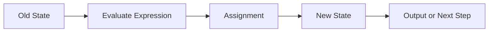

# Preparatory Unit P-U02: How Does a Program Remember Data and Change State?

Version: 1.0.1  
Status: Official student material  
Last updated: 2026-08-05  
Corresponding Chinese version: [前導單元 P-U02：程式如何記住資料並改變狀態？](unit-02-data-state.zh-TW.md)

## Purpose and Completion Standard

This is a student chapter for independent reading, practice, and review. Completing the chapter means more than producing correct output. You should be able to explain the relationship among values, types, variables, and state, trace how assignments change state, and use tests to show that a modified program still satisfies its requirement.

The activities do not need to be submitted. Keep your predictions, state tables, programs, tests, and corrections for your own review.

## What Question Does This Chapter Answer?

In the previous Unit, the program printed fixed text. Real programs must preserve data, update it, and produce new results from the current state.

> How does a program preserve current data and produce a new state after each execution step?

After completing this chapter, you should be able to:

1. Distinguish data, value, type, variable name, and current value.
2. Trace state changes caused by initialization, assignment, and expressions.
3. Distinguish basic integer and floating-point behavior.
4. Build a simple input-process-output flow.
5. Check whether input succeeded before using a variable.
6. Update expected results and tests after a requirement changes.

Prerequisite: you can create, compile, and run a minimal C program and write an expected output before execution.

---

## 1. Predict the State First

```c
int score = 80;
score = score + 5;
printf("%d\n", score);
```

Before running it, answer:

1. What is `score` after the first line?
2. Does the `score` on the right side of the second line mean the old value or the new value?
3. After the second line runs, does the old value still remain as the current value?
4. What is printed?

---

## 2. Five Core Concepts

### Data

Information processed by a program, such as a score, temperature, or character.

### Value

The actual content at one moment, such as `80`, `3.5`, or `'A'`.

### Type

A type determines how data is represented and which operations are available.

```c
int count = 5;
double temperature = 23.5;
char grade = 'A';
```

### Variable

A variable uses a name to refer to a currently stored value. The name is not the value itself; the same name may hold different values at different times.

### State

The collection of the current values of important variables at a particular moment.

---

## 3. State-Change Model



This statement:

```c
score = score + 5;
```

can be understood as:

```text
Read the old value 80 on the right
→ compute 80 + 5
→ obtain 85
→ write 85 into score on the left
```

---

## 4. Minimal Executable Example

```c
#include <stdio.h>

int main(void) {
    int score = 80;
    score = score + 5;
    printf("%d\n", score);
    return 0;
}
```

Expected output:

```text
85
```

State trace:

| Step | Statement | `score` before | Expression result | `score` after |
|---|---|---:|---:|---:|
| 1 | `int score = 80;` | does not exist yet | 80 | 80 |
| 2 | `score = score + 5;` | 80 | 85 | 85 |
| 3 | `printf(...)` | 85 | 85 | 85 |

---

## 5. Initialization and Assignment Are Different

Initialization gives a value when a variable is created:

```c
int score = 80;
```

Assignment updates a variable that already exists:

```c
score = 90;
```

In C, `=` means assignment, not mathematical equality. The left side identifies what will be updated; the right side is evaluated first.

---

## 6. Input, Processing, and Output

```c
#include <stdio.h>

int main(void) {
    int score;

    if (scanf("%d", &score) != 1) {
        fprintf(stderr, "Invalid input\n");
        return 1;
    }

    score = score + 5;
    printf("Adjusted score: %d\n", score);

    return 0;
}
```

For now, treat `&score` as the form that allows `scanf` to write input into `score`. Its pointer meaning will be studied in a later Unit.

`scanf` reports how many requested values were successfully read. The program must check that result before using `score`; otherwise a failed input operation can leave the variable without a valid value.

Tests:

| Input | Expected result |
|---:|---|
| 80 | `Adjusted score: 85` |
| 0 | `Adjusted score: 5` |
| -5 | `Adjusted score: 0` |
| `abc` | error message and nonzero exit status |

---

## 7. Error Case One: Integer Division

```c
int total = 5;
int count = 2;
double average = total / count;
printf("%.1f\n", average);
```

Predict before running. The result is:

```text
2.0
```

Both operands of `total / count` are `int`, so integer division happens first and produces `2`. That result is converted to `double` afterward.

Correction:

```c
double average = (double) total / count;
```

Verify with `5/2`, `4/2`, and `1/2`.

---

## 8. Error Case Two: Format and Type Do Not Match

```c
int score = 80;
printf("%f\n", score);
```

`%f` expects a floating-point value, but `score` is an `int`. This mismatch causes undefined behavior. Use compiler warnings as diagnostic evidence rather than trusting an accidental screen result.

Correct form:

```c
printf("%d\n", score);
```

Common mappings:

| Type | `printf` | `scanf` |
|---|---|---|
| `int` | `%d` | `%d` |
| `double` | `%f` | `%lf` |
| `char` | `%c` | `%c` |

---

## 9. Guided Practice: Increase a Temperature

Requirement: read an integer temperature, add one, and print the result.

First:

1. Write the input, processing, and output.
2. Predict the results for inputs `20` and `-1`.
3. Include a nonnumeric input test.
4. Build a state table.
5. Write, compile, run, and compare.

---

## 10. Independent Practice: Score Adjuster

Read an original score and a bonus, then display:

```text
Final score: <value>
```

Create at least four tests: a normal value, zero bonus, a negative or extreme value, and invalid input. Use meaningful variable names and keep the state table and actual results.

---

## 11. Requirement Modification

New rule: the adjusted score cannot exceed 100.

Update the tests first:

| Original | Bonus | Expected result |
|---:|---:|---:|
| 80 | 5 | 85 |
| 98 | 5 | 100 |
| 100 | 0 | 100 |

Then modify the program and confirm that the original and invalid-input cases still behave correctly.

---

## 12. Explain the Concept to AI

Explain in your own words:

> What is the relationship among a variable, a value, a type, and program state? How does assignment change state?

An AI response may be incomplete or incorrect. If it conflicts with a state table, compiler warning, or reproducible execution result, judge the claim again using evidence.

---

## 13. Self-Check

- I can distinguish a variable name from its current value.
- I can explain initialization and assignment.
- I can trace state line by line.
- I can check input success before using a variable.
- I can explain the difference between `5 / 2` and `5.0 / 2`.
- I can select basic format specifiers from the data type.
- I can update tests and run a regression check after a requirement change.

---

## 14. Chapter Summary

Program execution is not only about producing output. It repeatedly transforms an old state into a new state. Variables preserve current values, types constrain representation and operations, expressions produce results, and assignments write results back into state. External input must be validated before it becomes reliable program state. The next Unit uses conditions and loops to decide how state changes next.

## Navigation

- [Previous Unit: How Does Program Text Become an Execution Result?](unit-01-execution.en.md)
- [Next Unit: How Does a Program Select and Repeat?](unit-03-control-flow.en.md)
- [Materials Index](../README.en.md)
- [繁體中文版](unit-02-data-state.zh-TW.md)
