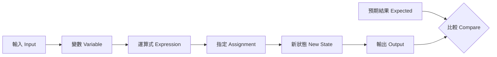

# 前導單元 2：資料、型別與程式狀態

版本：0.2.0  
狀態：正式教學教材  
最後更新：2026-08-03  
重大變更摘要：移除提交、逐份通過、補驗與重複微型口試措辭，改為自主保存、課堂形成性討論與一次最終口試準備。  
對應英文版本：[Preparatory Unit 2: Data, Types, and Program State](unit-02-data-state.en.md)

## 文件用途

供教師、助教與學生直接使用。中文前導班安排於第 1 堂後段與第 2 堂；英文前導班安排於 Session 2。

本單元的作業與學習紀錄不繳交、不計分、不逐份批改。學生自行保存狀態表、程式、測試、錯誤與 AI 使用紀錄，供下堂課討論及最終一對一口試準備。

## 基本資料

- 需求 ID：`CAP-D01` 至 `CAP-D04`、`X-02`、`X-03`、`X-04`
- 能力 ID：`PC-D01` 至 `PC-D05`、`PC-V01`、`PC-V03`
- 目標成熟度：L2–L4
- 範圍狀態：`SB-C`
- 形成性任務：`AT-02`、`AT-03`、`AT-05`、`AT-06`、`AT-08`
- 最終口試參照：`AT-12`
- 風險 ID：`R-02`、`R-05`、`R-09`
- 預估時間：中文 150–180 分鐘；英文 120 分鐘

## 一、學習目標

學生能：

1. 區分值、型別、變數名稱與目前值。
2. 逐步追蹤宣告、初始化、指定與運算式造成的狀態改變。
3. 根據資料意義選擇適當的 `int` 或 `double`。
4. 建立基本輸入、處理與輸出流程。
5. 修改一項需求並更新預期結果與測試。

## 二、前置知識

- 能建立、編譯與執行最小 C 程式。
- 能在執行前寫下預期輸出。
- 能區分編譯問題與錯誤結果。

若尚未穩定，可先使用單元 1 的備援活動與形成性補救練習，不以抄寫完整程式取代理解。

## 三、工具與環境

- GCC 或 Clang，支援 C17。
- 編譯：`gcc -std=c17 -Wall -Wextra -pedantic score.c -o score`
- 備援：教師預先測試的線上 C 編譯器、紙上追蹤或教師設備。

工具故障不等於未參與或能力不足。

## 四、資訊優先級

### 必須理解

- 變數名稱不是值本身。
- 型別限制資料如何表示與運算。
- 指定會改變程式狀態。
- 輸入是假設，輸出必須由預期結果驗證。

### 必須完成

- 一份狀態追蹤表。
- 一個輸入—處理—輸出程式。
- 一次型別或運算式錯誤診斷。
- 一次需求修改與回歸測試。

以上由學生自行保存，不需繳交。

### 目前可跳過

- 位元表示、溢位完整分類、複雜轉型與未定義行為分類。

## 五、核心問題

> 程式如何記住資料、改變資料，並讓我們確認改變後的結果合理？

## 六、視覺模型



驗證方式：先手算，再執行；若不一致，找出第一個狀態不同的位置。

## 七、核心概念

- 值 Value：實際資料，例如 `80`。
- 型別 Type：資料的表示與可用操作，例如 `int`、`double`。
- 變數 Variable：用名稱指涉目前資料狀態。
- 初始化 Initialization：宣告時給定初始值。
- 指定 Assignment：把新結果寫入變數。
- 運算式 Expression：由值、變數與運算子組成並產生結果。

## 八、最小可執行範例

```c
#include <stdio.h>

int main(void) {
    int score = 80;
    score = score + 5;
    printf("%d\n", score);
    return 0;
}
```

預期輸出：

```text
85
```

## 九、狀態追蹤

| 步驟 | 敘述 | `score` 之前 | 運算結果 | `score` 之後 |
|---|---|---:|---:|---:|
| 1 | `int score = 80;` | 不存在 | 80 | 80 |
| 2 | `score = score + 5;` | 80 | 85 | 85 |
| 3 | `printf(...)` | 85 | 85 | 85 |

課堂形成性追問：右側與左側的 `score` 分別扮演什麼角色？

這是課堂討論，不是獨立口試。

## 十、輸入—處理—輸出範例

```c
#include <stdio.h>

int main(void) {
    int score;
    scanf("%d", &score);
    score = score + 5;
    printf("Adjusted score: %d\n", score);
    return 0;
}
```

正常案例：輸入 `80`，預期 `Adjusted score: 85`。  
邊界案例：輸入 `0`，預期 `Adjusted score: 5`。

本單元只把 `&score` 視為 `scanf` 寫入變數所需的形式，不深入指標語意。

## 十一、常見錯誤

### 整數除法

```c
int total = 5;
int count = 2;
double average = total / count;
```

結果可能是 `2.0`，不是 `2.5`。先追蹤運算元型別，再改為：

```c
double average = (double) total / count;
```

學生必須說明修正原因，不能只換成 AI 提供的寫法。

### 格式與型別不一致

使用 `%d` 輸出 `double` 或 `%lf` 讀取 `int` 都屬錯誤。以編譯器警告、實際行為與型別表驗證。

## 十二、引導練習

建立「溫度加一」程式：讀入整數溫度，加一後輸出。

學生自行保存：

1. 輸入、處理、輸出表。
2. 兩個預期結果。
3. 程式與實際結果。
4. 一句狀態改變說明。

## 十三、自主作業

### 成績調整器

讀入原始成績與加分，輸出調整後成績。

- 輸入：兩個整數。
- 輸出：`Final score: <value>`。
- 限制：使用具意義的變數名稱；先建立三個測試。
- 自行保存：狀態表、程式、測試表與說明。

允許不同合理寫法，不因與範例不同而扣分。作業不繳交、不逐份計分；下堂課可能討論其中的錯誤、測試或不同解法。

## 十四、需求修改

新增規則：「調整後成績最高為 100」。學生須：

1. 指出受影響的處理步驟。
2. 更新預期結果，至少加入超過 100 的案例。
3. 修改程式。
4. 回歸原有案例。
5. 說明為何原測試不足。

## 十五、AI 使用規則

允許：完成第一版後，請 AI 提供可能遺漏的測試或解釋編譯警告。  
禁止：在建立狀態表與初版方案前索取完整答案；使用無法解釋的程式。  
必須自行保存：使用前方案、自建測試、建議摘要、驗證方法、採用或拒絕理由。

## 十六、自我檢核

- 我能說明值、型別、變數名稱與目前值的差異。
- 我能追蹤指定前後的狀態。
- 我能解釋 `5 / 2` 與 `5.0 / 2` 的差異。
- 我能在需求修改後更新測試。
- 我能驗證而不是直接相信 AI 建議。

此自我檢核不是作業分數。

## 十七、課堂參與觀察

參與可以透過：

- 說明狀態變化。
- 提出測試或邊界案例。
- 分享整數除法或型別錯誤。
- 操作程式、記錄追蹤表或匿名提問。
- 修正自己或同儕的推論。

不以出席或發言次數單獨判定參與。

## 十八、最終口試準備

學生應準備在一次最終一對一口試中，對等值案例進行說明、追蹤、修改或診斷。本單元不預先固定口試題型、時間或抽題方式。

## 十九、教師與助教指引

- 先要求手算，再執行。
- 不把 `scanf` 的位址語意擴張成指標課。
- 若時間不足，保留狀態追蹤、型別錯誤與需求修改；減少練習數量。
- 不以成功輸出單獨判定能力。
- 用形成性追問取代逐份作業批改與重複微型口試。

## 二十、單元摘要

本單元建立「程式執行就是狀態改變」的模型。下一單元將用條件與重複決定狀態如何改變。

## 導覽

- [評量制度補充規則](ASSESSMENT-NOTE.zh-TW.md)
- [教師執行指引](../instructor/session-guides.zh-TW.md)
- [C17 範例與缺陷案例](../../examples/README.md)
- [教材索引](../README.zh-TW.md)
- [English version](unit-02-data-state.en.md)
