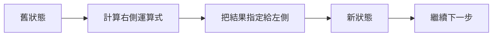

# 前導單元 P-U02：程式如何記住資料並改變狀態？

版本：1.3.0  
狀態：學生教材  
最後更新：2026-08-11  
對應英文版本：[Preparatory Unit P-U02: How Does a Program Remember Data and Change State?](unit-02-data-state.en.md)

## 這一章要回答什麼？

上一章的程式很單純：進入 `main` 之後，依序執行幾個敘述、印出固定文字，然後結束。可是只要程式要處理成績、溫度、金額或任何會改變的資訊，就不能永遠只印固定內容。

程式需要先「記住現在有什麼」，做完一步運算後，再得到新的內容。這就是這一章要追蹤的問題：

> 程式如何保存目前的資料，並在一步一步執行的過程中改變自己的狀態？

我們會先從一個只有三行的 `score` 範例開始，觀察值怎麼改變，再把同樣的想法帶到輸入、整數與浮點運算，以及幾個常見錯誤。

讀到最後，你應該能夠：

1. 分清楚資料、值、型別、變數名稱與目前值。
2. 逐行追蹤初始化、指定與運算式造成的狀態改變。
3. 看出整數與浮點運算的基本差異。
4. 把簡單程式看成「輸入 → 處理 → 輸出」。
5. 知道外部輸入成功後，才應該把它當成可用資料。
6. 在需求改變時，先改預期結果與測試，再決定程式要怎麼改。

如果你已經能沿著 P-U01 的執行順序追蹤一支最小 C 程式，就可以直接開始。

---

## 1. 先不要執行，追蹤 `score`

看看這三行：

```c
int score = 80;
score = score + 5;
printf("%d\n", score);
```

先不要執行。用紙筆或腦中一步一步走：

1. 第一行結束後，`score` 是多少？
2. 第二行右側的 `score` 讀到的是原本的值，還是更新後的值？
3. 第二行執行完後，`score` 現在是多少？
4. 最後會印出什麼？

如果你覺得 `score = score + 5` 看起來很奇怪，那正好。數學裡很少會寫「一個數等於自己加五」，但 C 裡的 `=` 不是數學等號。這件事很快就會拆開來看。

---

## 2. 先把五個概念分開

在追蹤程式之前，先給幾個之後會一直用到的名字。

### 資料（data）

程式要處理的資訊，例如成績、溫度、數量或字元。

### 值（value）

某一刻真正存在的內容，例如 `80`、`3.5` 或 `'A'`。

### 型別（type）

型別告訴 C 這個值要用什麼方式表示，以及可以怎麼運算。例如：

```c
int count = 5;
double temperature = 23.5;
char grade = 'A';
```

現在只需要先認得三種常見情況：`int` 用來處理整數，`double` 可以表示帶小數的數值，`char` 用來表示一個字元。

如果你會接著好奇：「這些型別最後到底怎麼變成記憶體裡的 bits？」可以讀完全選做的 [P-U02 位元層級資料表示附錄](appendix-bit-level-data-representation.zh-TW.md)。那份附錄會用整數、正負數與二補數、IEEE 754 浮點模型、`char` 與字元編碼來回答這個問題；跳過完全不影響本章與 P-U03。

### 變數（variable）

變數讓程式用一個名稱保存目前的值。例如 `score` 是名稱，`80` 是它在某一刻保存的值。

同一個名稱在不同時間可以有不同的目前值。這正是程式能「改變」的原因之一。

### 狀態（state）

如果我們把某一刻重要變數的目前值全部記下來，就得到那一刻的程式狀態。

現在的例子只有一個變數，所以狀態很簡單：

```text
score = 80
```

執行下一行後，它可能變成：

```text
score = 85
```

---

## 3. `score = score + 5` 到底做了什麼？

先看這張圖：



對這一行：

```c
score = score + 5;
```

可以一步一步讀成：

```text
讀取右側 score 的舊值 80
→ 計算 80 + 5
→ 得到 85
→ 把 85 寫回左側的 score
```

所以 `=` 在這裡表示的是**指定（assignment）**：先算右邊，再把結果放到左邊。

執行前：

```text
score = 80
```

執行後：

```text
score = 85
```

這就是一次狀態改變。

---

## 4. 放回完整程式裡追一次

```c
#include <stdio.h>

int main(void) {
    int score = 80;
    score = score + 5;
    printf("%d\n", score);
    return 0;
}
```

預期輸出：

```text
85
```

如果把每一行執行前後的 `score` 記下來：

| 步驟 | 敘述 | 執行前 `score` | 這一步算出的結果 | 執行後 `score` |
|---|---|---:|---:|---:|
| 1 | `int score = 80;` | 尚未建立 | 80 | 80 |
| 2 | `score = score + 5;` | 80 | 85 | 85 |
| 3 | `printf(...)` | 85 | 輸出 85 | 85 |

注意第三行：`printf` 使用了 `score` 的目前值，但沒有改變它。所以「程式執行了一行」不代表「狀態一定改變」。

---

## 5. 初始化和指定長得很像，但不是同一件事

第一次建立變數時就給它值，叫做**初始化（initialization）**：

```c
int score = 80;
```

變數已經存在之後，再改變它目前保存的值，叫做**指定（assignment）**：

```c
score = 90;
```

兩行都看得到 `=`，但發生的時機不同。第一行在建立 `score`；第二行是在更新已經存在的 `score`。

這個差異之後談到變數生命週期、函數和記憶體時還會再出現。現在先能分辨「建立並給初值」和「更新現有值」就足夠了。

---

## 6. 資料也可以從程式外面進來

到目前為止，`80` 都直接寫在程式碼裡。接下來讓使用者輸入成績。

```c
#include <stdio.h>

int main(void) {
    int score;

    if (scanf("%d", &score) != 1) {
        fprintf(stderr, "Invalid input\n");
        return 1;
    }

    score = score + 5;
    printf("Adjusted score: %d\n", score);

    return 0;
}
```

這段程式出現了幾個你還沒正式學過的符號，先不用一次理解全部。

- `scanf("%d", &score)` 嘗試讀入一個整數，並把它放進 `score`。
- `&score` 的完整意義和指標有關，會在後續正式學習；現在先把整個寫法當成 `scanf` 讀入 `score` 時需要的形式。
- `if (...)` 是條件判斷，下一個 Unit 會正式學。這裡只需要知道：如果沒有成功讀到一個整數，程式就先顯示錯誤並結束，不繼續使用 `score`。

為什麼要先檢查？因為使用者可能輸入：

```text
abc
```

如果輸入根本沒有成功轉成整數，就不能假裝 `score` 已經有一個可靠的成績。

先試四個輸入：

| 輸入 | 預期結果 |
|---:|---|
| 80 | `Adjusted score: 85` |
| 0 | `Adjusted score: 5` |
| -5 | `Adjusted score: 0` |
| `abc` | 顯示錯誤訊息並結束，不計算調整後成績 |

這裡真正要帶走的不是 `if` 的語法，而是一個習慣：**外部資料成功進入程式之後，才把它當成可靠狀態使用。**

---

## 7. 第一個容易意外的地方：整數除法

現在多看一種「型別會影響結果」的情況：

```c
int total = 5;
int count = 2;
double average = total / count;
printf("%.1f\n", average);
```

你可能直覺預測 `2.5`，但實際結果是：

```text
2.0
```

原因在右邊這一段：

```c
total / count
```

兩個運算元都是 `int`，所以 C 先做整數除法，得到 `2`。之後這個 `2` 才被轉成 `double`，成為 `2.0`。

如果希望除法本身就用浮點方式計算，可以寫：

```c
double average = (double) total / count;
```

試著比較三組值：`5 / 2`、`4 / 2`、`1 / 2`。每次都先預測，再執行。

---

## 8. 第二個容易出錯的地方：輸出格式和型別不一致

看看這兩行：

```c
int score = 80;
printf("%f\n", score);
```

`score` 是 `int`，但 `%f` 要求的是另一種對應的值。這不是單純「印得不好看」，而是會造成未定義行為。因此不要根據某一次偶然印出的畫面猜它是不是可以用；編譯器警告在這裡是很重要的診斷證據。

正確形式是：

```c
printf("%d\n", score);
```

目前常用的基本對應可以先放在旁邊查：

| 型別 | `printf` | `scanf` |
|---|---|---|
| `int` | `%d` | `%d` |
| `double` | `%f` | `%lf` |
| `char` | `%c` | `%c` |

不用現在背整張表。當你使用一個型別時，再確認它應該搭配什麼格式即可。

---

## 9. 動手追蹤：溫度加一

需求很簡單：讀入一個整數溫度，加一之後輸出。

先別急著寫完整程式。先用下面兩個例子建立預期：

```text
輸入 20 → 輸出 21
輸入 -1 → 輸出 0
```

接著畫一個只有 `temperature` 的小狀態表，確認「讀入」和「加一」各自讓狀態發生了什麼。

最後再寫程式、編譯、執行並比較。也試一次非數字輸入，確認程式不會把失敗的輸入當成有效溫度繼續使用。

---

## 10. 自己完成：成績調整器

現在把前面的例子稍微放大。程式要讀入兩個整數：原始成績和加分，最後輸出：

```text
Final score: <value>
```

例如：

```text
原始成績 80，加分 5 → Final score: 85
```

你可以用兩個變數，例如 `score` 和 `bonus`。如果不知道 `scanf` 怎麼一次讀兩個整數，可以從這個形式開始：

```c
scanf("%d %d", &score, &bonus)
```

和前面一樣，真正使用兩個值之前，要先確認它們都成功讀入。

至少試幾種不同情況：一般加分、加分為 0、負數，以及無效輸入。每次先寫預期，再看實際結果。

---

## 11. 先遇到一個目前還缺工具的需求

現在產品需求多了一條規則：

> 調整後成績最高只能是 100。

先不要急著找新的語法。先只更新測試：

| 原始成績 | 加分 | 預期結果 |
|---:|---:|---:|
| 80 | 5 | 85 |
| 98 | 5 | 100 |
| 100 | 0 | 100 |

如果你把目前的程式直接拿去跑 `98 + 5`，它很可能得到 `103`。這不是因為指定或加法壞掉，而是因為我們還沒有告訴程式：

> 「只有超過 100 的時候，才要改成 100。」

這正好形成下一章的問題。程式已經會保存和更新狀態了；下一步是讓它根據目前狀態，決定**接下來要走哪一條路**。

---

## 12. 選做：用 AI 挑戰自己的狀態解釋

如果你想多做一個練習，先用自己的話回答：

> 變數、值、型別與程式狀態之間有什麼關係？`score = score + 5` 又怎麼讓狀態改變？

接著可以把你的解釋交給 AI，請它指出可能含糊或不完整的地方。這一節完全選做，不需要固定 Prompt，也不需要保存對話。

如果 AI 的說法和你的狀態表、編譯器警告或可重現的執行結果衝突，回到證據重新判斷。

---

## 13. 讀完後，試著不用翻書回答

- `score` 這個名稱和它目前保存的值有什麼不同？
- 初始化和指定有什麼差別？
- `score = score + 5` 為什麼不是數學上的矛盾？
- 哪些敘述會改變狀態？哪些可能只讀取目前狀態？
- 為什麼使用 `scanf` 取得資料後，要先確認輸入成功？
- 為什麼 `5 / 2` 和 `5.0 / 2` 可能得到不同結果？
- `printf` 的格式和變數型別為什麼必須對應？

哪一題講不順，就回到對應程式，把狀態再追一次。

---

## 14. 本章收尾

上一章先讓我們追蹤「程式開始執行後，敘述以什麼順序產生可觀察結果」；這一章再往程式內部走一步：程式執行時，會讀取目前的值、計算新的結果，再透過指定讓狀態改變。

變數讓我們為目前值取名字；型別影響值的表示與運算；運算式產生結果；指定把結果放回新的狀態。從外部讀進來的資料，也要先確認成功，才能安全地成為後續計算的一部分。

如果你想在離開 P-U02 前再往下看一層，可以選讀 [資料在位元層級是怎麼表示的？](appendix-bit-level-data-representation.zh-TW.md)，把本章的 `int`、`double`、`char` 接到 binary、二補數、浮點表示與字元編碼。這不是前往 P-U03 的前置要求。

現在還剩下一個剛剛已經遇到的問題：如果 `score` 超過 100，程式要怎麼決定「這次要把它改成 100」，而其他時候保持原本結果？

下一個 Unit 就從這個問題開始，學習條件與重複，讓程式不只會改變狀態，還會決定狀態接下來怎麼改變。

## 導覽

- [P-U02 選讀附錄：資料在位元層級是怎麼表示的？](appendix-bit-level-data-representation.zh-TW.md)
- [上一單元：程式開始執行後，敘述怎麼變成結果？](unit-01-execution.zh-TW.md)
- [下一單元：程式如何選擇與重複？](unit-03-control-flow.zh-TW.md)
- [教材索引](../README.zh-TW.md)
- [English version](unit-02-data-state.en.md)
