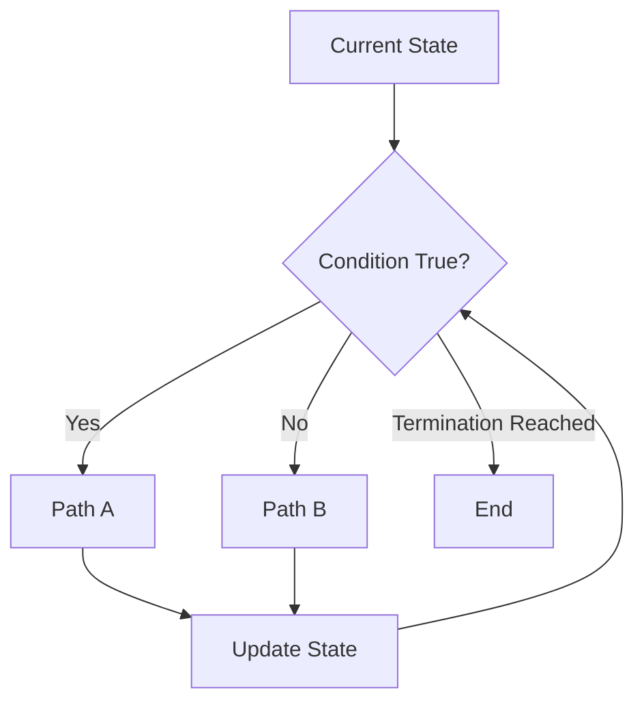

# Preparatory Unit 3: Conditions, Loops, and Control Flow

Version: 0.2.0  
Status: Official teaching material  
Last updated: 2026-08-03  
Major change summary: Removed homework submission, per-item passing, remediation, and repeated micro-oral wording; reframed the unit around student-retained records, formative classroom discussion, and final-oral preparation.  
Corresponding Chinese version: [前導單元 3：條件、迴圈與控制流程](unit-03-control-flow.zh-TW.md)

## Document Purpose

The Chinese preparatory track uses this material across Sessions 2–3; the English preparatory track uses it in Session 3.

## Basic Information

- Requirement IDs: `CAP-C01` through `CAP-C04`, `X-02`, `X-03`, `X-04`
- Competency IDs: `PC-C01` through `PC-C07`, `PC-V01` through `PC-V04`
- Target maturity: L2–L4
- Scope state: `SB-C`
- Formative tasks: `AT-03`, `AT-05`, `AT-06`, `AT-07`, `AT-08`
- Final oral preparation: `AT-12`
- Risk IDs: `R-02`, `R-05`, `R-09`
- Estimated time: Chinese 180 minutes; English 120 minutes

## 1. Learning Objectives

Students can:

1. Translate requirements into evaluable conditions.
2. Predict the path through `if` and `else`.
3. Define loop initial state, continuation condition, update, and termination.
4. Diagnose infinite loops and off-by-one errors.
5. Verify control flow with normal and boundary cases.

## 2. Prerequisites

- Trace variable state.
- Build expressions and basic input/output.
- State expected results before execution.

When prerequisites are weak, use formative support rather than copied programs or resubmitted homework.

## 3. Tools and Environment

- GCC or Clang with C17 support.
- Compile: `gcc -std=c17 -Wall -Wextra -pedantic control.c -o control`
- Fallback: an instructor-tested online C compiler.

## 4. Information Priority

### Must Understand

- A condition chooses a path from current state.
- A loop is repeated state update until termination, not merely repeated syntax.
- Boundary cases often reveal control-flow defects.

### Must Complete and Retain

- One conditional-path trace.
- One iteration-by-iteration loop trace.
- One diagnosis of an off-by-one or infinite-loop defect.
- One requirement modification with regression testing.

These records are not submitted or individually graded. Students retain them for the next class discussion and final oral preparation.

### May Be Deferred

- Complex nesting, `goto`, large state machines, and optimization techniques.

## 5. Core Question

> How does a program choose the next action from current state and repeat work reliably?

## 6. Visual Model



Verification method: record state before and after every condition evaluation in a trace table.

## 7. Conditional Example

```c
#include <stdio.h>

int main(void) {
    int score;
    scanf("%d", &score);

    if (score >= 60) {
        printf("Pass\n");
    } else {
        printf("Try again\n");
    }

    return 0;
}
```

Test `59`, `60`, and `61`. Predict the path and output first.

## 8. Loop Example

```c
#include <stdio.h>

int main(void) {
    int i = 1;
    int sum = 0;

    while (i <= 5) {
        sum = sum + i;
        i = i + 1;
    }

    printf("%d\n", sum);
    return 0;
}
```

Expected output: `15`.

## 9. Four-Part Loop Trace

| Element | This Example |
|---|---|
| Initial state | `i = 1`, `sum = 0` |
| Continuation condition | `i <= 5` |
| Work | `sum = sum + i` |
| Update | `i = i + 1` |
| Termination | `i` becomes 6 |

| Iteration | `i` Before Test | Condition | `sum` After Work | `i` After Update |
|---:|---:|---|---:|---:|
| 1 | 1 | true | 1 | 2 |
| 2 | 2 | true | 3 | 3 |
| 3 | 3 | true | 6 | 4 |
| 4 | 4 | true | 10 | 5 |
| 5 | 5 | true | 15 | 6 |
| End | 6 | false | 15 | 6 |

## 10. Common Errors

### Off-by-One

Change `i <= 5` to `i < 5`; the result becomes `10`. Students identify the missing iteration instead of only saying the answer is wrong.

### Infinite Loop

Remove `i = i + 1`. Diagnosis:

1. Reproduce the non-terminating behavior.
2. Identify the condition variable `i`.
3. Check whether `i` changes inside the loop.
4. Restore the update and test with a small range.

## 11. Guided Practice

### Age Classification

Read an age. Print `Minor` below 18, otherwise `Adult`.

Retain a condition table, expected results for `17/18/19`, the program, and actual results.

### Counter

Print 1 through 5. Complete the four loop elements before coding.

## 12. Independent Practice

### Range Sum

Read a positive integer `n` and print the sum from 1 through `n`.

- Normal case: `n = 5`.
- Boundary case: `n = 1`.
- Necessary exceptional case: for `n <= 0`, print `Invalid input`.
- Retain: trace table, program, three test categories, and diagnostic explanation.

Homework is not submitted or individually graded. The next class discusses representative errors, tests, and alternative solutions.

## 13. Requirement Modification

Change the program from summing 1 through `n` to summing only even values. Students must:

1. Identify where the new condition belongs.
2. Change the expected result for `n = 5` to 6.
3. Retain the `n = 1` and invalid-input tests.
4. Run regression verification.

## 14. AI Use Rules

Permitted: after completing the trace table, ask AI for additional tests or candidate defect causes.  
Prohibited: ask AI to calculate the trace table step by step or generate the complete independent-practice answer.  
Must retain: own four-part loop model, expected results, AI suggestion, verification, and decision.

## 15. Formative Learning Evidence and Classroom Discussion

### Understanding-Oriented Evidence

- `EV-TR + EV-EX`
- Trace conditions and loops iteration by iteration.
- Explain termination and identify the first incorrect state.

### Action-Oriented Evidence

- `EV-IM + EV-TE + EV-DE + EV-MO`
- Correct a control-flow defect.
- Complete a requirement change and regression test.

### Formative Prompts

1. Why is `60` an important test?
2. When does the loop stop?
3. Which state no longer changes when the update is removed?

These prompts support classroom discussion and participation observation. They are not separate oral exams or per-homework grading.

### Participation Modes

- Complete or revise a trace table.
- Propose a boundary case.
- Share a defect and diagnostic hypothesis.
- Compare alternative loop forms.
- Participate through writing, anonymous questions, program operation, or group records.

## 16. Instructor and TA Guidance

- Build the model with tables before syntax.
- Require students to identify all four loop elements.
- When time is short, reduce exercise count but retain tracing, boundary testing, and diagnosis.
- Do not increase difficulty through complex nesting.
- When tools fail, switch to paper tracing or instructor equipment; do not treat the failure as non-participation.

## 17. Final Oral Preparation

Students should be able to select from their own records:

- One off-by-one defect.
- One infinite-loop cause.
- One requirement change with regression testing.
- One AI suggestion they accepted, modified, or rejected.

This unit prepares capability evidence without fixing final oral question types or procedure in advance.

## 18. Unit Summary

Conditions choose paths; loops repeat work through state updates. The next unit separates responsibilities with functions and integrates testing, modification, debugging, and AI verification.

## Navigation

- [Materials Index](../README.en.md)
- [Assessment Override](ASSESSMENT-NOTE.en.md)
- [繁體中文版](unit-03-control-flow.zh-TW.md)
