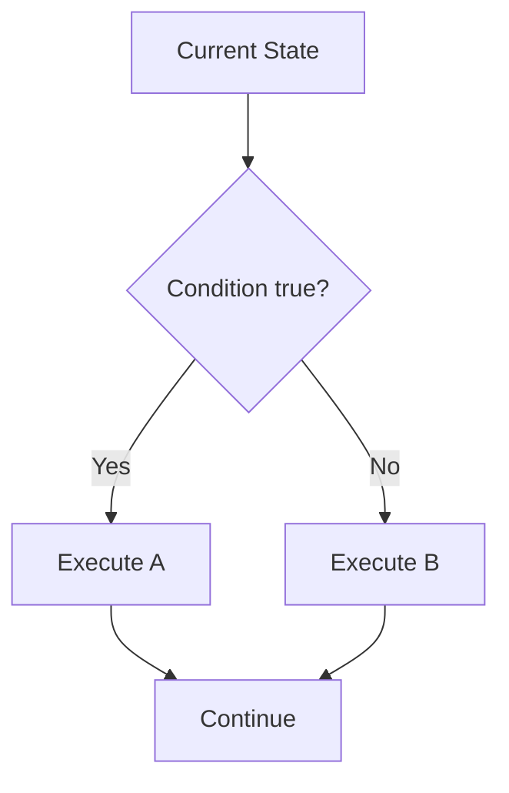
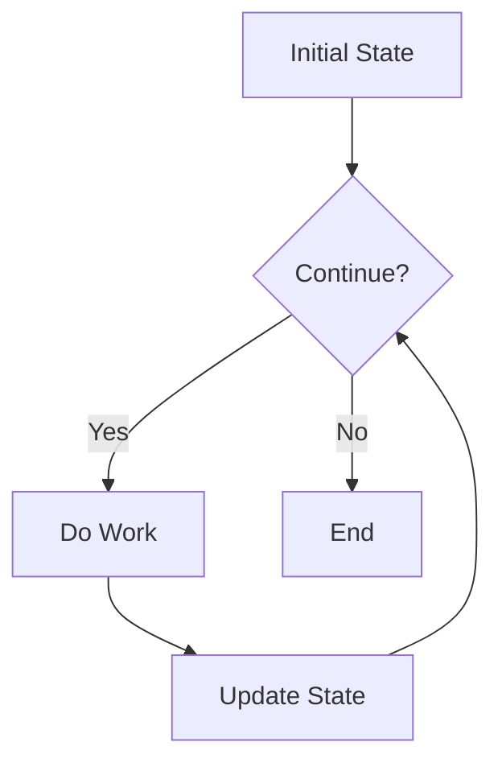

# Preparatory Unit P-U03: How Does a Program Select and Repeat?

Version: 1.0.1  
Status: Official student material  
Last updated: 2026-08-05  
Corresponding Chinese version: [前導單元 P-U03：程式如何選擇與重複？](unit-03-control-flow.zh-TW.md)

## Purpose and Completion Standard

This is a student chapter for independent reading, practice, and review. Completing it means you can turn a requirement into conditions, predict branch and loop paths, diagnose boundary and termination problems, and use tests to show that control flow satisfies the requirement.

The activities do not need to be submitted. Keep your predictions, traces, programs, tests, and corrections.

## What Question Does This Chapter Answer?

Program state does not always change in the same way. Sometimes different situations require different paths. Sometimes work must repeat until a condition is no longer true.

> When different situations require different actions, or one action must repeat, how does a program determine the next step?

After completing this chapter, you should be able to:

1. Turn requirements into evaluable conditions.
2. Predict `if`/`else` execution paths.
3. Explain a loop's initial state, continuation condition, work, and update.
4. Diagnose off-by-one errors and infinite loops.
5. Check input success before evaluating conditions.
6. Verify control flow with normal, boundary, and invalid cases.

Prerequisite: you can trace variable state, build basic expressions, and write an expected result before execution.

---

## 1. Predict the Branch First

```c
int score = 60;

if (score >= 60) {
    printf("Pass\n");
} else {
    printf("Try again\n");
}
```

Before running it, answer:

1. What is the result of `score >= 60`?
2. Which block runs?
3. What changes if `score` becomes 59?
4. Why is 60 an important test value?

---

## 2. Conditions and Branches

A condition is an expression that evaluates to true or false. A branch selects a path from that result.



Minimal example:

```c
#include <stdio.h>

int main(void) {
    int score;

    if (scanf("%d", &score) != 1) {
        fprintf(stderr, "Invalid input\n");
        return 1;
    }

    if (score >= 60) {
        printf("Pass\n");
    } else {
        printf("Try again\n");
    }

    return 0;
}
```

Test `59`, `60`, and `61`. Write each expected path and output before running. Also test a nonnumeric input and confirm that no branch uses an invalid `score` value.

---

## 3. Relational and Logical Operators

| Meaning | C form |
|---|---|
| equal | `==` |
| not equal | `!=` |
| greater than | `>` |
| greater than or equal | `>=` |
| less than | `<` |
| less than or equal | `<=` |

Logical combinations:

```c
age >= 18 && age <= 65
score < 0 || score > 100
!is_valid
```

Do not confuse assignment `=` with comparison `==`.

---

## 4. A Loop Is More Than Repeated Syntax

A loop repeatedly changes state until its continuation condition becomes false.



Four elements:

1. Initial state
2. Continuation condition
3. Work performed each time
4. Update

---

## 5. Minimal Loop Example

```c
#include <stdio.h>

int main(void) {
    int i = 1;
    int sum = 0;

    while (i <= 5) {
        sum = sum + i;
        i = i + 1;
    }

    printf("%d\n", sum);
    return 0;
}
```

Expected output:

```text
15
```

Trace:

| Iteration | `i` before test | Condition | `sum` after work | `i` after update |
|---:|---:|---|---:|---:|
| 1 | 1 | true | 1 | 2 |
| 2 | 2 | true | 3 | 3 |
| 3 | 3 | true | 6 | 4 |
| 4 | 4 | true | 10 | 5 |
| 5 | 5 | true | 15 | 6 |
| End | 6 | false | 15 | 6 |

---

## 6. `for` and `while`

The same work can be written as:

```c
int sum = 0;

for (int i = 1; i <= 5; i = i + 1) {
    sum = sum + i;
}
```

A `for` loop places initialization, condition, and update together. A `while` loop often emphasizes the continuation condition. You should be able to identify the four loop elements in either form.

---

## 7. Error Case One: Off-by-One

Change:

```c
i <= 5
```

to:

```c
i < 5
```

The result becomes `10`. Do not stop at saying “5 is missing.” Identify that the iteration where `i == 5` is skipped.

Use boundary values `4`, `5`, and `6` to inspect the condition.

---

## 8. Error Case Two: Infinite Loop

```c
int i = 1;

while (i <= 5) {
    printf("%d\n", i);
}
```

`i` never changes, so the condition remains true.

Diagnosis:

1. Identify variables used by the continuation condition.
2. Check whether they change in the loop.
3. Confirm that the direction of change can eventually make the condition false.
4. Restore the update and test with a small range.

---

## 9. Error Case Three: A Broader Condition Hides a Later One

```c
if (score >= 60) {
    printf("Pass\n");
} else if (score >= 90) {
    printf("Excellent\n");
}
```

For input 95, the first condition is already true, so the second branch can never be selected.

Correction: test the stricter condition first.

```c
if (score >= 90) {
    printf("Excellent\n");
} else if (score >= 60) {
    printf("Pass\n");
} else {
    printf("Try again\n");
}
```

---

## 10. Guided Practice

### Age Classification

Read an age. Print `Minor` when it is below 18; otherwise print `Adult`.

Create tests for `17`, `18`, `19`, and invalid input first.

### Counter

Print 1 through 5. Write the four loop elements before choosing `while` or `for`.

---

## 11. Independent Practice: Range Sum

Read a positive integer `n` and print the sum from 1 through `n`.

Requirements:

- `n = 5` expects 15.
- `n = 1` expects 1.
- `n <= 0` prints `Invalid input`.
- Nonnumeric input is rejected before the loop.
- Build an iteration trace.

---

## 12. Requirement Modification

The original program sums 1 through `n`. Change it to sum only even numbers.

Update expected results first:

| `n` | Expected result |
|---:|---:|
| 1 | 0 |
| 5 | 6 |
| 6 | 12 |

Identify where the new condition belongs, modify the program, and preserve both invalid-value and invalid-format tests.

---

## 13. Explain the Concept to AI

Explain in your own words:

> How does a condition select a path? How does a loop use state updates to decide whether to continue?

An AI response may be incomplete or incorrect. If it conflicts with a trace table, boundary test, or reproducible result, judge it again using evidence.

---

## 14. Self-Check

- I can translate a requirement into a condition.
- I can predict an `if`/`else` path.
- I can check input success before evaluating a condition.
- I can identify the four loop elements.
- I can trace loop state one iteration at a time.
- I can diagnose off-by-one errors and infinite loops.
- I can design normal, boundary, and invalid cases.
- I can run regression tests after a requirement change.

---

## 15. Chapter Summary

Conditions select paths from the current state. Loops repeatedly perform work and update state until a condition becomes false. Reliable control flow requires validated input, path prediction, state tracing, boundary tests, and termination reasoning. The next Unit divides larger work into functions with clear responsibilities.

## Navigation

- [Previous Unit: How Does a Program Remember Data and Change State?](unit-02-data-state.en.md)
- [Next Unit: How Can a Large Problem Be Divided into Understandable Work?](unit-04-functions-integration.en.md)
- [Materials Index](../README.en.md)
- [繁體中文版](unit-03-control-flow.zh-TW.md)
