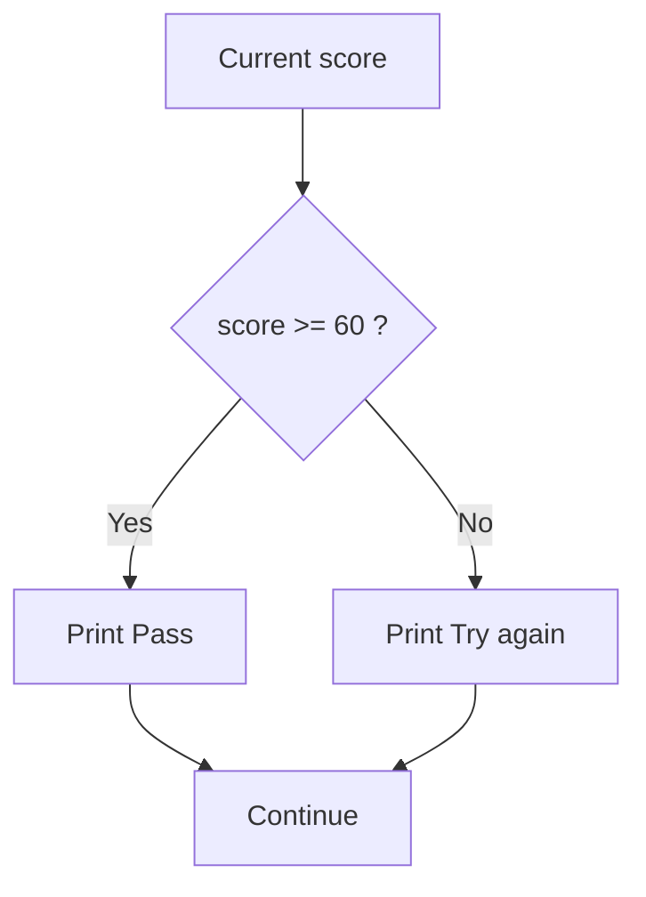

# Preparatory Unit P-U03: How Does a Program Select and Repeat?

Version: 1.1.0  
Status: Official student material  
Last updated: 2026-08-09  
Corresponding Chinese version: [前導單元 P-U03：程式如何選擇與重複？](unit-03-control-flow.zh-TW.md)

The previous Unit deliberately left one problem unresolved.

Suppose the program reads an original score of `98` and then adds a bonus of `5`. Plain arithmetic gives:

```text
103
```

But the requirement says that the final score may not exceed 100.

What is missing is not another kind of addition. The program needs a way to **make a decision**: only when the result is above 100 should it be changed to 100; otherwise, the original result should remain.

This chapter begins with that need. First the program will learn to choose a path. Then we will handle another common control problem: when the same work must happen many times, how does the program decide whether to continue?

---

## 1. Let the Program Choose a Path for the First Time

Start with the most direct correction:

```c
int score = 98;
int bonus = 5;
int final_score = score + bonus;

if (final_score > 100) {
    final_score = 100;
}

printf("Final score: %d\n", final_score);
```

Do not treat `if` as syntax to memorize yet. Read it first as a sentence:

> If `final_score > 100` is true, change `final_score` to 100.

With `score = 98` and `bonus = 5`, `final_score` first becomes 103. The condition is then true, so the state changes once more to 100.

Now change the starting values to:

```c
int score = 80;
int bonus = 5;
```

`final_score` first becomes 85. This time `final_score > 100` is false, so the assignment inside the braces does not run and the result remains 85.

That is the basic role of a branch: **use the current state to decide whether some work should happen.**

---

## 2. What Exactly Is a Condition?

In:

```c
if (final_score > 100)
```

the expression that actually makes the decision is:

```c
final_score > 100
```

It evaluates to either true or false.

Before running anything, inspect these three values:

| `final_score` | `final_score > 100` | Change it to 100? |
|---:|---|---|
| 99 | false | No |
| 100 | false | No |
| 101 | true | Yes |

The most informative value here is 100. The requirement says “at most 100,” so 100 itself should be preserved. Only a value greater than 100 needs correction.

This is why boundary values deserve special attention. Many condition defects do not appear at ordinary values such as 50 or 80; they appear exactly where the rule changes from one case to another.

---

## 3. When Both Paths Need Different Work

Some requirements are not simply “do one extra thing if a condition is true.” Instead, two situations require two different actions.

For example:

> Print `Pass` for a score of 60 or above; otherwise print `Try again`.

That can be written as:

```c
if (score >= 60) {
    printf("Pass\n");
} else {
    printf("Try again\n");
}
```

Think of it as a fork in the path:



For scores 59, 60, and 61, walk through the diagram yourself before running the program.

Pay special attention to 60:

```c
score >= 60
```

includes equality, so 60 follows the `Pass` path.

---

## 4. Common Ways to Compare Values

Conditions often begin with comparisons. You do not need to memorize the whole table at once; use it when a requirement needs one of these relationships.

| Meaning | C form |
|---|---|
| equal | `==` |
| not equal | `!=` |
| greater than | `>` |
| greater than or equal | `>=` |
| less than | `<` |
| less than or equal | `<=` |

One difference is worth deliberately noticing early:

```c
score = 60;
```

is assignment: it stores 60 in `score`.

```c
score == 60
```

is comparison: it asks whether `score` equals 60.

They differ by only one `=`, but they play completely different roles.

---

## 5. When One Comparison Is Not Enough

Suppose a valid score must be between 0 and 100. We want to say:

> `score` is at least 0 and at most 100.

In C:

```c
score >= 0 && score <= 100
```

`&&` means that both sides must be true.

If instead we want to describe an invalid value—below 0 or above 100—we can write:

```c
score < 0 || score > 100
```

`||` means that at least one side is true.

You may also see:

```c
!is_valid
```

`!` reverses a true/false interpretation.

It is usually easier to understand the requirement as a sentence first and then read the symbols than to memorize the symbols without a situation attached to them.

---

## 6. Now Read the Input Check Properly

The previous Unit already used this pattern:

```c
int score;

if (scanf("%d", &score) != 1) {
    printf("Invalid input\n");
    return 1;
}
```

At that point, you only needed to know its purpose: confirm that input succeeded before using the value. Now we can read the choice it makes.

When `scanf` successfully reads one integer, the call reports one successful conversion. Therefore:

```c
scanf("%d", &score) != 1
```

is false, and the error-handling block is skipped.

If the input cannot be read as an integer, the condition is true. The program prints `Invalid input` and then ends with `return 1;` instead of continuing with a `score` value that was never successfully obtained.

Why `scanf` needs `&score` will be explained more fully when pointers are introduced. For now, it is enough to know that this is the form `scanf` needs in order to place the integer it reads into `score`.

---

## 7. Branch Order Can Change the Result

Consider:

```c
if (score >= 60) {
    printf("Pass\n");
} else if (score >= 90) {
    printf("Excellent\n");
}
```

With a score of 95, you might expect `Excellent`. But the first condition, `score >= 60`, is already true. The program chooses that path, so the later `else if` is never checked.

If the requirement is:

- 90 or above: `Excellent`
- 60 through 89: `Pass`
- otherwise: `Try again`

then ask the stricter question first:

```c
if (score >= 90) {
    printf("Excellent\n");
} else if (score >= 60) {
    printf("Pass\n");
} else {
    printf("Try again\n");
}
```

The important idea is not how to format an `else if`. It is that **an earlier condition may already claim some states**, preventing later branches from ever seeing them.

When several branches are involved, choose a few representative values and ask, one condition at a time: “Where does this value become true for the first time?” That is often more revealing than staring at the code as a whole.

---

## 8. Control Flow Is Not Only About Choosing

A branch answers “which path should happen this time?” Another kind of problem appears when the same work must repeat.

For example:

> Add 1, 2, 3, 4, and 5.

You could write:

```c
sum = 1 + 2 + 3 + 4 + 5;
```

But if the requirement changes to 1 through 100, or 1 through a user-provided `n`, this form is no longer practical.

The repeated pattern is really:

```text
add the current i into sum
move i forward
then decide whether to continue
```

That is the problem a loop solves.

---

## 9. Use `while` to See the Four Parts of a Loop

```c
int i = 1;
int sum = 0;

while (i <= 5) {
    sum = sum + i;
    i = i + 1;
}

printf("%d\n", sum);
```

The expected output is:

```text
15
```

When reading a loop, repeatedly ask four questions:

1. What is the initial state?
2. Under what condition should the loop continue?
3. What work happens in each iteration?
4. What update moves the program toward stopping?

In this example, those parts are:

```text
i = 1, sum = 0

continue while i <= 5

sum = sum + i

i = i + 1
```

Expanding the repeated work into state changes gives:

| `i` before this test | `i <= 5` | `sum` after the work | `i` after the update |
|---:|---|---:|---:|
| 1 | true | 1 | 2 |
| 2 | true | 3 | 3 |
| 3 | true | 6 | 4 |
| 4 | true | 10 | 5 |
| 5 | true | 15 | 6 |
| 6 | false | no more work | 6 |

A trace table is not meant to create extra paperwork. It turns “many repetitions” back into a sequence of state changes that you already know how to follow.

---

## 10. How Can a Loop Be Off by One?

Change:

```c
i <= 5
```

to:

```c
i < 5
```

and predict the result.

When `i` reaches 5, the condition is already false, so the iteration that should add 5 never happens. The final sum becomes 10.

A defect that performs one iteration too many or too few is commonly called an off-by-one error.

The name matters less than a useful diagnostic question:

> When the boundary value is reached, should that iteration happen or not?

For this example, substitute `i = 4`, `5`, and `6` into the condition. The difference between `<= 5` and `< 5` becomes much easier to see.

---

## 11. Why Do Some Loops Never Stop?

Now consider:

```c
int i = 1;

while (i <= 5) {
    printf("%d\n", i);
}
```

`i` begins at 1, so the condition is true. After printing 1, `i` is still 1. The next test is true again, and the same thing continues.

The problem is not that `while` itself is dangerous. The state controlling the loop never changes in a direction that can make the condition false.

When a loop appears not to terminate, inspect the variables used by its continuation condition, ask whether they change inside the loop, and then ask whether those changes can actually make the condition false one day.

After restoring:

```c
i = i + 1;
```

trace a small range such as 1 through 5 again. Small inputs are safer and clearer for this kind of diagnosis than immediately trying a large range.

---

## 12. `for` Expresses the Same Idea in Another Form

The same summation can be written as:

```c
int sum = 0;

for (int i = 1; i <= 5; i = i + 1) {
    sum = sum + i;
}
```

A `for` loop places initialization, continuation condition, and update together. A `while` loop often makes “continue while this condition remains true” more visually prominent.

There is no need yet to decide which is more advanced. What matters is that, in either form, you can identify the initial state, continuation condition, work, and update.

---

## 13. Try It: Start with a Choice

Write a program that reads an age and follows this rule:

```text
below 18 → Minor
18 or above → Adult
```

Do not begin with a large collection of inputs. Choose three informative values first: 17, 18, and 19.

Before execution, write down what the condition becomes for each value and which path should be taken. Then run the program and compare. Finally, try a nonnumeric input and confirm that failed input is not used to classify an age.

---

## 14. Try It Again: Add from 1 through `n`

Now write a program that reads a positive integer `n` and prints the sum from 1 through `n`.

Begin with two small expectations:

```text
n = 1 → 1
n = 5 → 15
```

If `n <= 0`, the requirement says to print:

```text
Invalid input
```

Nonnumeric input must also be rejected before the loop begins.

After the first working version, choose one input and trace the state iteration by iteration. If the output is wrong, do not immediately change the condition at random. Find the first iteration where the actual state begins to differ from what you predicted.

---

## 15. Change the Requirement: Add Only Even Numbers

The original “sum from 1 through `n`” requirement now becomes:

> Add only the even numbers in the range.

Update the expected results before editing the program:

| `n` | Expected sum |
|---:|---:|
| 1 | 0 |
| 5 | 6 |
| 6 | 12 |

Then ask: does the loop still need to move to the next `i`? At what point should the new “is this value even?” decision happen?

After modifying the program, test the new behavior, but also repeat `n = 1`, an invalid numeric value, and a nonnumeric input. The change should not accidentally remove protections that previously worked.

---

## 16. Optional: Use AI to Challenge Your Control-Flow Explanation

If you want one extra exercise, first answer without any tool:

> How does a branch use state to choose a path? How does a loop use state updates to decide whether another iteration should happen?

You may then give your explanation to an AI system and ask it to point out anything unclear. This section is completely optional. No fixed prompt is required, and no conversation needs to be saved or submitted.

If an AI explanation conflicts with a path you traced, a state table, a boundary test, or a reproducible result, return to that evidence and judge the explanation again.

---

## 17. After Reading, Try to Answer without Looking Back

- Why does `final_score > 100`, rather than `final_score >= 100`, match an “at most 100” requirement?
- What is the difference between `=` and `==`?
- Why do 59, 60, and 61 reveal more about a pass/fail boundary than testing only 80?
- Why can the order of several `if`/`else if` branches make a later branch unreachable?
- What four parts should you be able to identify in a loop?
- At which iteration does the difference between `i < 5` and `i <= 5` matter?
- How can you reason about whether a loop can eventually stop?
- Why should a variable not be used in a condition after its input operation failed?

If one answer is difficult to explain, return to the corresponding small program and walk through it with a concrete value.

---

## 18. Chapter Closing

The previous Unit gave the program state. This Unit added another layer: a program can inspect that state, choose different work, and repeatedly update state to decide whether more work should happen.

The core of a branch is not the braces; it is deciding which condition represents which situation in the requirement. The core of a loop is not repeated syntax; it is understanding what state keeps the loop going and what update can eventually make it stop.

At this point, we can write programs that store data, change state, choose paths, and repeat work. As those programs grow, however, putting every responsibility inside `main` quickly becomes difficult to read, modify, and verify.

The next Unit addresses that problem by dividing larger work into functions with names, inputs, results, and clear responsibilities.

## Navigation

- [Previous Unit: How Does a Program Remember Data and Change State?](unit-02-data-state.en.md)
- [Next Unit: How Can a Large Problem Be Divided into Understandable Work?](unit-04-functions-integration.en.md)
- [Materials Index](../README.en.md)
- [繁體中文版](unit-03-control-flow.zh-TW.md)
