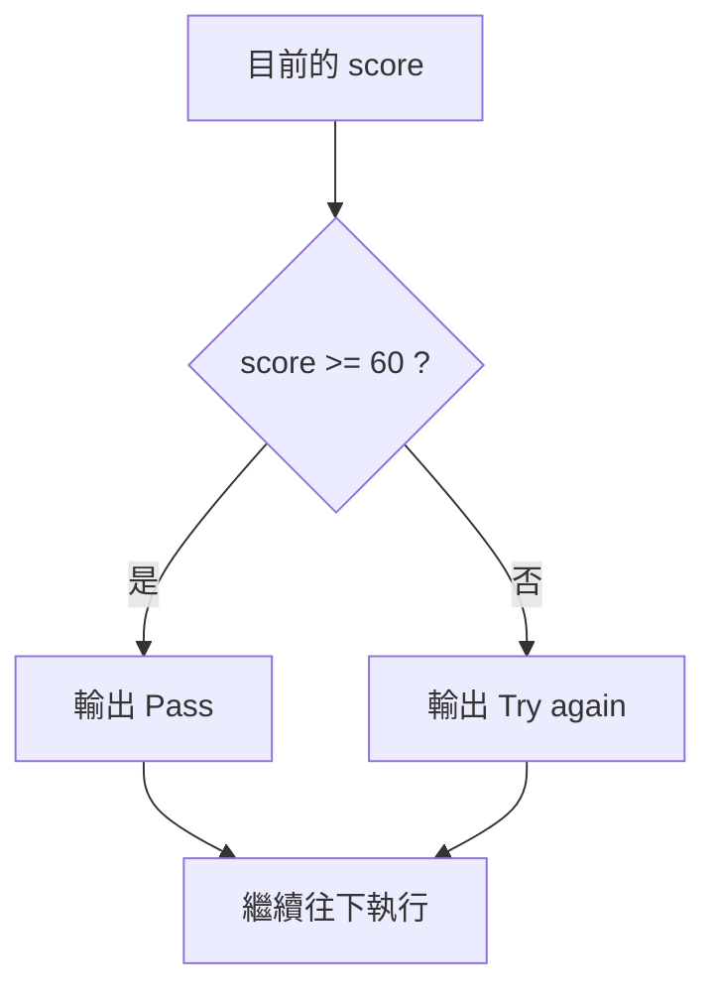

# 前導單元 P-U03：程式如何選擇與重複？

版本：1.1.0  
狀態：正式學生教材  
最後更新：2026-08-09  
對應英文版本：[Preparatory Unit P-U03: How Does a Program Select and Repeat?](unit-03-control-flow.en.md)

上一個 Unit 留下了一個故意沒有解決的問題。

假設程式讀到原始成績 `98`，再加上 `5` 分。單純計算會得到：

```text
103
```

但需求明明是「最高只能是 100」。

我們現在缺的不是另一種加法，而是一種**做決定的能力**：只有結果超過 100 時才改成 100，其他時候保留原本的結果。

這一章就從這個需求開始。先讓程式學會選擇，再進一步處理另一種常見問題：同一件事需要做很多次時，怎麼決定要不要繼續。

---

## 1. 第一次讓程式選路

先看最直接的修正：

```c
int score = 98;
int bonus = 5;
int final_score = score + bonus;

if (final_score > 100) {
    final_score = 100;
}

printf("Final score: %d\n", final_score);
```

讀程式時先不要把 `if` 當成要背的新語法。先用一句話描述它：

> 如果 `final_score > 100` 成立，就把 `final_score` 改成 100。

當 `score = 98`、`bonus = 5` 時，`final_score` 先變成 103。接著條件成立，所以狀態再被改成 100。

如果改成：

```c
int score = 80;
int bonus = 5;
```

`final_score` 會先得到 85。這一次 `final_score > 100` 不成立，大括號裡的指定不會執行，因此結果仍然是 85。

這就是分支最基本的作用：**根據目前狀態，決定某一段工作要不要發生。**

---

## 2. 條件到底是什麼？

在：

```c
if (final_score > 100)
```

真正做判斷的是：

```c
final_score > 100
```

它是一個會得到真或假的運算式。

試著先不要執行程式，只看下列三個值：

| `final_score` | `final_score > 100` | 會改成 100 嗎？ |
|---:|---|---|
| 99 | false | 不會 |
| 100 | false | 不會 |
| 101 | true | 會 |

這裡最重要的是 100。需求說「最高只能是 100」，所以 100 本身應該被保留，只有大於 100 才需要修正。

這也是為什麼邊界值特別值得測：很多條件錯誤都不是在 50 或 80 這種普通值出現，而是在「剛好等於界線」的地方出現。

---

## 3. 如果兩條路都要有事情做

有些需求不是「條件成立才多做一件事」，而是兩種情況要做不同的事。

例如：

> 成績 60 分以上輸出 `Pass`，否則輸出 `Try again`。

可以寫成：

```c
if (score >= 60) {
    printf("Pass\n");
} else {
    printf("Try again\n");
}
```

把它想成一個岔路：



輸入 59、60、61 時，先自己走一次這張圖再執行。

特別注意 60：

```c
score >= 60
```

包含「等於」，所以 60 會走 `Pass` 那一條路。

---

## 4. 幾個常用的比較方式

條件常從比較開始。現在不必一次背完，只要在需要時查表即可。

| 想表達的意思 | C 寫法 |
|---|---|
| 等於 | `==` |
| 不等於 | `!=` |
| 大於 | `>` |
| 大於等於 | `>=` |
| 小於 | `<` |
| 小於等於 | `<=` |

有一個初學時很值得刻意提醒自己的差別：

```c
score = 60;
```

是指定，把 60 放進 `score`。

```c
score == 60
```

才是在比較 `score` 是否等於 60。

它們只差一個 `=`，角色卻完全不同。

---

## 5. 一個條件不夠時

假設有效成績只能落在 0 到 100 之間。我們想描述：

> `score` 同時大於等於 0，而且小於等於 100。

C 可以寫成：

```c
score >= 0 && score <= 100
```

`&&` 表示兩邊都要成立。

如果想描述「小於 0 或大於 100，任一種都算無效」，可以寫：

```c
score < 0 || score > 100
```

`||` 表示至少一邊成立。

還會看到：

```c
!is_valid
```

`!` 表示把真假反過來理解。

先用需求語句讀懂，再看符號，比死背符號容易得多。

---

## 6. 把輸入檢查讀懂

上一個 Unit 已經看過這段程式：

```c
int score;

if (scanf("%d", &score) != 1) {
    printf("Invalid input\n");
    return 1;
}
```

當時只要求你知道「先確認輸入成功再使用資料」。現在可以正式讀懂其中的選擇。

`scanf` 成功讀到一個整數時，這次呼叫會回報成功轉換了一個值，所以：

```c
scanf("%d", &score) != 1
```

會是 false，錯誤處理那一段就跳過。

如果輸入不是可讀成整數的內容，條件會成立，程式先輸出 `Invalid input`，再用 `return 1;` 結束，而不會繼續拿一個沒有成功取得的 `score` 去判斷及格與否。

`&score` 為什麼這樣寫，等到正式學指標時會更完整解釋；目前只要知道，`scanf` 需要這個形式才能把讀到的整數放進 `score`。

---

## 7. 分支順序也會改變結果

看看下面的程式：

```c
if (score >= 60) {
    printf("Pass\n");
} else if (score >= 90) {
    printf("Excellent\n");
}
```

如果 `score` 是 95，你可能期待看到 `Excellent`，但實際上第一個條件 `score >= 60` 已經成立，因此程式直接選了第一條路，後面的 `else if` 不會再被檢查。

如果需求是：

- 90 分以上：`Excellent`
- 60 到 89：`Pass`
- 其他：`Try again`

就應該先問比較嚴格的問題：

```c
if (score >= 90) {
    printf("Excellent\n");
} else if (score >= 60) {
    printf("Pass\n");
} else {
    printf("Try again\n");
}
```

這裡真正要學的不是「`else if` 要怎麼排版」，而是：**前面的條件可能已經把某些狀態拿走了。**

遇到多個分支時，拿幾個代表值逐條問：「它會在哪一個條件第一次成立？」通常比直接盯著程式碼更容易發現問題。

---

## 8. 選擇之外，還有另一種控制問題

分支處理的是「這次走哪一條路」。但有些需求不是二選一，而是同一件事要重複。

例如：

> 把 1、2、3、4、5 加起來。

當然可以手寫：

```c
sum = 1 + 2 + 3 + 4 + 5;
```

但如果需求變成 1 加到 100、1 加到使用者輸入的 `n`，這種寫法就不再實用。

真正重複的其實是同一個模式：

```text
拿目前的 i 加進 sum
讓 i 前進一格
再決定要不要繼續
```

這就是迴圈要處理的事情。

---

## 9. 先用 `while` 看見迴圈的四個部分

```c
int i = 1;
int sum = 0;

while (i <= 5) {
    sum = sum + i;
    i = i + 1;
}

printf("%d\n", sum);
```

預期輸出是：

```text
15
```

讀這個迴圈時，可以固定問四個問題：

1. 一開始的狀態是什麼？
2. 什麼條件下要繼續？
3. 每一輪真正做的工作是什麼？
4. 哪一個更新讓程式逐漸靠近停止？

在這個例子裡分別是：

```text
i = 1, sum = 0

只要 i <= 5 就繼續

sum = sum + i

i = i + 1
```

如果把每一輪攤開，狀態會這樣變：

| 這次判斷前的 `i` | 條件 `i <= 5` | 工作後的 `sum` | 更新後的 `i` |
|---:|---|---:|---:|
| 1 | true | 1 | 2 |
| 2 | true | 3 | 3 |
| 3 | true | 6 | 4 |
| 4 | true | 10 | 5 |
| 5 | true | 15 | 6 |
| 6 | false | 不再執行 | 6 |

追蹤表不是為了把事情做得更麻煩，而是把「很多次重複」拆回一連串你已經會追蹤的狀態變化。

---

## 10. 為什麼迴圈會差一次？

把：

```c
i <= 5
```

改成：

```c
i < 5
```

再預測結果。

這一次當 `i` 變成 5 時，條件已經是 false，所以「把 5 加進去」那一輪根本沒有發生，最後得到 10。

這類剛好多一次或少一次的問題常叫做 off-by-one error。

與其只記這個名稱，更有用的診斷方式是直接問：

> 邊界值到達時，那一輪到底應不應該執行？

對這個例子來說，拿 `i = 4`、`5`、`6` 去代入條件，就很容易看出 `<= 5` 和 `< 5` 的差別。

---

## 11. 為什麼有些迴圈永遠停不下來？

再看一個版本：

```c
int i = 1;

while (i <= 5) {
    printf("%d\n", i);
}
```

`i` 一開始是 1，條件成立；輸出 1 之後，`i` 還是 1。下一次條件仍然成立，之後也一樣。

問題不是「`while` 很危險」，而是控制迴圈的狀態從來沒有往終止方向改變。

遇到疑似無窮迴圈時，可以依序檢查：持續條件看哪些變數、那些變數在迴圈裡有沒有改變，以及改變的方向是否真的可能讓條件有一天變成 false。

在這個例子裡補回：

```c
i = i + 1;
```

之後，再用 1 到 5 這種小範圍重新追蹤一次，會比直接拿很大的資料測試安全也清楚。

---

## 12. `for` 是同一個想法的另一種寫法

剛剛的加總也可以寫成：

```c
int sum = 0;

for (int i = 1; i <= 5; i = i + 1) {
    sum = sum + i;
}
```

`for` 把初始化、持續條件與更新集中在同一行；`while` 則常讓「只要什麼條件仍然成立，就繼續」更明顯。

現在不用急著問哪一個比較高級。比較重要的是，不論看到哪一種寫法，你都能指出：初始狀態、持續條件、每輪工作和更新。

---

## 13. 動手做：先從選擇開始

寫一個程式讀入年齡：

```text
小於 18 → Minor
18 以上 → Adult
```

先不要立刻輸入很多數字。先挑三個最有資訊量的值：17、18、19。

在執行之前，先寫下每個值會讓條件得到什麼結果、會走哪一條路，再實際執行比較。最後再試一次非數字輸入，確認程式不會把失敗的輸入拿去判斷年齡。

---

## 14. 再動手做：把 1 加到 `n`

接著寫一個程式，讀入正整數 `n`，輸出 1 到 `n` 的總和。

先用兩個很小的例子建立預期：

```text
n = 1 → 1
n = 5 → 15
```

如果 `n <= 0`，需求規定輸出：

```text
Invalid input
```

非數字輸入也必須在進入迴圈之前被拒絕。

第一次完成後，挑一個值畫出逐輪狀態。如果輸出不對，不要先亂改條件；先找出第一輪「實際狀態和你原本預測開始不同」的位置。

---

## 15. 改需求：只加偶數

現在原本的「1 加到 `n`」改成：

> 只把範圍內的偶數加起來。

先更新預期，不要先改程式：

| `n` | 預期總和 |
|---:|---:|
| 1 | 0 |
| 5 | 6 |
| 6 | 12 |

接著思考：原本迴圈的「前進到下一個 `i`」仍然需要嗎？新的「是不是偶數」判斷應該放在哪一個時刻？

修改後，除了測新需求，也重新測 `n = 1`、無效數值和非數字輸入，確認舊的保護沒有因為修改而消失。

---

## 16. 選做：用 AI 挑戰自己的控制流程解釋

如果你想多做一個練習，先不用任何工具回答：

> 分支如何根據狀態選一條路？迴圈又如何靠狀態更新決定下一輪是否繼續？

接著可以把自己的說法交給 AI，請它找可能含糊的地方。這一節完全選做，不需要固定 Prompt，也不需要保存或繳交對話。

如果 AI 的說法和你自己畫出的路徑、追蹤表、邊界測試或可重現結果不一致，回到那些證據重新判斷。

---

## 17. 讀完後，試著不用翻書回答

- 為什麼 `final_score > 100` 而不是 `final_score >= 100` 能符合「最高 100」的需求？
- `=` 和 `==` 分別在做什麼？
- 為什麼 59、60、61 比只測 80 更容易檢查及格條件？
- 多個 `if`／`else if` 的順序為什麼可能讓後面的分支永遠走不到？
- 一個迴圈要能說清楚哪四個部分？
- `i < 5` 和 `i <= 5` 的差異會在哪一輪出現？
- 怎麼判斷一個迴圈是否有可能停止？
- 為什麼輸入失敗時不應該繼續使用該變數做條件判斷？

哪一題說不順，就回到對應的小程式，自己代入一個值再走一次。

---

## 18. 本章收尾

上一個 Unit 讓程式開始有「狀態」；這個 Unit 再多加了一層：程式可以看著目前狀態，選擇不同工作，也可以透過反覆更新狀態來決定要不要繼續。

分支的核心不是大括號，而是「哪個條件代表需求中的哪個情況」；迴圈的核心也不是重複語法，而是「什麼狀態讓它繼續，以及什麼更新最後會讓它停止」。

到這裡，我們已經能寫出會保存資料、改變狀態、做選擇並重複工作的程式。但程式一長，所有事情都塞在 `main` 裡會很快變得難讀、難改，也難確認哪一部分負責什麼。

下一個 Unit 會處理這個問題：把較大的工作拆成有名字、有輸入、有結果，而且責任清楚的函數。

## 導覽

- [上一單元：程式如何記住資料並改變狀態？](unit-02-data-state.zh-TW.md)
- [下一單元：如何把大問題拆成可理解的工作？](unit-04-functions-integration.zh-TW.md)
- [教材索引](../README.zh-TW.md)
- [English version](unit-03-control-flow.en.md)
