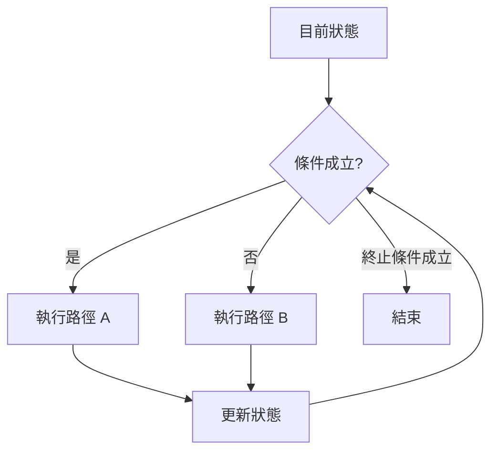

# 前導單元 3：條件、迴圈與控制流程

版本：0.1.0  
狀態：教學草案  
最後更新：2026-08-03  
重大變更摘要：建立條件、迴圈、終止條件、邊界測試與錯誤診斷教材。  
對應英文版本：[Preparatory Unit 3: Conditions, Loops, and Control Flow](unit-03-control-flow.en.md)

## 文件用途

中文前導班安排於第 2–3 堂；英文前導班安排於 Session 3。

## 基本資料

- 需求 ID：`CAP-C01` 至 `CAP-C04`、`X-02`、`X-03`、`X-04`
- 能力 ID：`PC-C01` 至 `PC-C07`、`PC-V01` 至 `PC-V04`
- 目標成熟度：L2–L4
- 範圍狀態：`SB-C`
- 驗收任務：`AT-03`、`AT-05`、`AT-06`、`AT-07`、`AT-08`、`AT-12`
- 風險 ID：`R-02`、`R-05`、`R-09`
- 預估時間：中文 180 分鐘；英文 120 分鐘

## 一、學習目標

學生能：

1. 將需求轉換成可求值的條件。
2. 預測 `if`／`else` 的執行路徑。
3. 定義迴圈的初始狀態、持續條件、更新與終止條件。
4. 診斷無窮迴圈與 off-by-one 錯誤。
5. 使用正常與邊界案例驗證控制流程。

## 二、前置知識

- 能追蹤變數狀態。
- 能建立運算式與基本輸入輸出。
- 能先寫預期結果再執行。

## 三、工具與環境

- GCC 或 Clang，C17。
- 編譯：`gcc -std=c17 -Wall -Wextra -pedantic control.c -o control`
- 備援：教師測試過的線上 C 編譯器。

## 四、資訊優先級

### 必須理解

- 條件依目前狀態選擇路徑。
- 迴圈不是「重複語法」，而是狀態反覆更新直到終止。
- 邊界案例常揭露控制流程錯誤。

### 必須完成

- 一份條件路徑追蹤。
- 一份迴圈逐次追蹤表。
- 一個 off-by-one 或無窮迴圈診斷。
- 一次需求修改與回歸測試。

### 目前可跳過

- 複雜巢狀流程、`goto`、大型狀態機與最佳化技巧。

## 五、核心問題

> 程式如何根據目前狀態選擇下一步，並可靠地重複工作？

## 六、視覺模型



驗證方式：用追蹤表記錄每一次條件判斷前後的狀態。

## 七、條件範例

```c
#include <stdio.h>

int main(void) {
    int score;
    scanf("%d", &score);

    if (score >= 60) {
        printf("Pass\n");
    } else {
        printf("Try again\n");
    }

    return 0;
}
```

測試：`59`、`60`、`61`。學生先預測每個輸入的路徑與輸出。

## 八、迴圈範例

```c
#include <stdio.h>

int main(void) {
    int i = 1;
    int sum = 0;

    while (i <= 5) {
        sum = sum + i;
        i = i + 1;
    }

    printf("%d\n", sum);
    return 0;
}
```

預期輸出：`15`。

## 九、迴圈四要素追蹤

| 要素 | 本例 |
|---|---|
| 初始狀態 | `i = 1`, `sum = 0` |
| 持續條件 | `i <= 5` |
| 每次工作 | `sum = sum + i` |
| 更新 | `i = i + 1` |
| 終止 | `i` 變成 6 |

| 次數 | `i` 判斷前 | 條件 | `sum` 更新後 | `i` 更新後 |
|---:|---:|---|---:|---:|
| 1 | 1 | true | 1 | 2 |
| 2 | 2 | true | 3 | 3 |
| 3 | 3 | true | 6 | 4 |
| 4 | 4 | true | 10 | 5 |
| 5 | 5 | true | 15 | 6 |
| 結束 | 6 | false | 15 | 6 |

## 十、常見錯誤

### Off-by-one

將 `i <= 5` 改成 `i < 5`，結果變成 `10`。學生須指出少做哪一次，而不是只說答案錯。

### 無窮迴圈

刪除 `i = i + 1`。診斷流程：

1. 重現程式不停止。
2. 找出條件依賴的變數 `i`。
3. 檢查 `i` 是否在迴圈內改變。
4. 補回更新並用小範圍測試。

## 十一、引導練習

### 年齡分類

讀入年齡：小於 18 輸出 `Minor`，否則輸出 `Adult`。

必須提交：條件表、`17/18/19` 預期結果、程式與實際結果。

### 計數器

輸出 1 到 5。先填寫四要素，再寫程式。

## 十二、獨立練習

### 範圍總和

讀入正整數 `n`，輸出 1 到 `n` 的總和。

- 正常案例：`n = 5`。
- 邊界案例：`n = 1`。
- 必要異常案例：`n <= 0` 時輸出 `Invalid input`。
- 必要證據：追蹤表、程式、三類測試與錯誤診斷說明。

## 十三、需求修改

原本計算 1 到 `n`，改成只加偶數。學生須：

1. 指出新增條件的位置。
2. 更新 `n = 5` 的預期結果為 6。
3. 保留 `n = 1` 與無效輸入測試。
4. 執行回歸驗證。

## 十四、AI 使用規則

允許：完成追蹤表後請 AI 補充測試或提出可能錯誤原因。  
禁止：請 AI 逐次代算追蹤表、直接生成獨立練習完整答案。  
必須保留：自己的四要素、預期結果、AI 建議、驗證與決策。

## 十五、驗收與補驗

- 理解證據：`EV-TR + EV-EX`。
- 行動證據：`EV-IM + EV-TE + EV-DE + EV-MO`。
- 通過：能追蹤條件與迴圈、指出終止原因、修正一個控制錯誤並完成需求修改。
- 補驗：以新輸入即時追蹤，或診斷另一個 off-by-one 程式。

微型口試：

1. 為什麼 `60` 是重要測試？
2. 迴圈何時停止？
3. 若拿掉更新，哪個狀態不再改變？

## 十六、教師與助教指引

- 先用表格建立模型，再進入語法。
- 每個迴圈都要求學生指出四要素。
- 時間不足時刪減題數，不刪追蹤、邊界測試與診斷。
- 不以複雜巢狀題增加難度。

## 十七、單元摘要

條件選擇路徑，迴圈透過狀態更新重複工作。下一單元將用函數分離責任，並整合測試、修改、除錯與 AI 驗證。

## 導覽

- [教材索引](../README.zh-TW.md)
- [English version](unit-03-control-flow.en.md)
