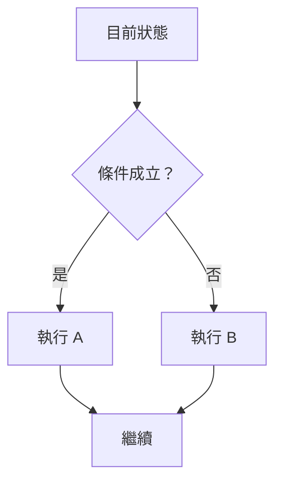
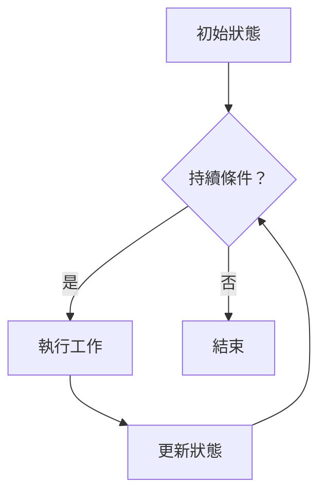

# 前導單元 P-U03：程式如何選擇與重複？

版本：1.0.2  
狀態：正式學生教材  
最後更新：2026-08-06  
對應英文版本：[Preparatory Unit P-U03: How Does a Program Select and Repeat?](unit-03-control-flow.en.md)

## 文件用途與完成標準

這是一份供初學者獨立閱讀、練習與複習的學生教材。完成本章代表你能把需求轉成條件，預測分支與迴圈路徑，找出邊界與終止問題，並用測試證明控制流程符合需求。

本章活動不需繳交；請自行保存預測、追蹤表、程式、測試與修正紀錄。不使用 AI 不影響本章完成；選用的 AI 延伸活動可以直接跳過，也不影響參與或評量。

## 這一章要回答什麼？

程式中的狀態不會總是用同一種方式改變。有時必須依條件選擇不同路徑，有時必須重複工作直到某個條件不再成立。

> 當不同狀況需要不同動作，或同一動作需要重複時，程式如何決定下一步？

完成本章後，你應能：

1. 將需求轉成可求值的條件。
2. 預測 `if`／`else` 的執行路徑。
3. 說明迴圈的初始狀態、持續條件、工作與更新。
4. 診斷 off-by-one 與無窮迴圈。
5. 在判斷條件前檢查輸入是否成功。
6. 使用正常、邊界與無效案例驗證控制流程。

前置知識：能追蹤變數狀態、建立基本運算式，並在執行前寫下預期結果。

---

## 1. 先預測條件路徑

```c
int score = 60;

if (score >= 60) {
    printf("Pass\n");
} else {
    printf("Try again\n");
}
```

在執行前回答：

1. 條件 `score >= 60` 的結果是什麼？
2. 哪一個區塊會執行？
3. 若 `score` 改成 59，路徑如何改變？
4. 為什麼 60 是重要測試？

---

## 2. 條件與分支

條件是一個會得到真或假的運算式。分支依條件結果選擇路徑。



最小範例：

```c
#include <stdio.h>

int main(void) {
    int score;

    if (scanf("%d", &score) != 1) {
        fprintf(stderr, "Invalid input\n");
        return 1;
    }

    if (score >= 60) {
        printf("Pass\n");
    } else {
        printf("Try again\n");
    }

    return 0;
}
```

測試 `59`、`60`、`61`，先寫下每個輸入的路徑與輸出。再測試非數字輸入，確認程式不會使用無效的 `score` 值進入分支。

---

## 3. 比較與邏輯運算子

常見比較：

| 意義 | C 寫法 |
|---|---|
| 等於 | `==` |
| 不等於 | `!=` |
| 大於 | `>` |
| 大於等於 | `>=` |
| 小於 | `<` |
| 小於等於 | `<=` |

常見邏輯組合：

```c
age >= 18 && age <= 65
score < 0 || score > 100
!is_valid
```

不要把指定 `=` 和比較 `==` 混在一起。

---

## 4. 迴圈不是單純重複語法

迴圈是狀態反覆更新，直到持續條件不再成立。



四個要素：

1. 初始狀態
2. 持續條件
3. 每次工作
4. 更新

---

## 5. 最小迴圈範例

```c
#include <stdio.h>

int main(void) {
    int i = 1;
    int sum = 0;

    while (i <= 5) {
        sum = sum + i;
        i = i + 1;
    }

    printf("%d\n", sum);
    return 0;
}
```

預期輸出：

```text
15
```

逐次追蹤：

| 次數 | 判斷前 `i` | 條件 | 更新後 `sum` | 更新後 `i` |
|---:|---:|---|---:|---:|
| 1 | 1 | true | 1 | 2 |
| 2 | 2 | true | 3 | 3 |
| 3 | 3 | true | 6 | 4 |
| 4 | 4 | true | 10 | 5 |
| 5 | 5 | true | 15 | 6 |
| 結束 | 6 | false | 15 | 6 |

---

## 6. `for` 與 `while`

相同工作也可以寫成：

```c
int sum = 0;

for (int i = 1; i <= 5; i = i + 1) {
    sum = sum + i;
}
```

`for` 把初始化、條件與更新集中在同一行；`while` 常讓持續條件更突出。兩者都必須能說明四個要素。

---

## 7. 錯誤案例一：Off-by-one

把：

```c
i <= 5
```

改成：

```c
i < 5
```

結果變成 `10`。不要只說答案少了 5；請指出「當 `i == 5` 時，原本應執行的那一次被跳過」。

用邊界值 `4`、`5`、`6` 檢查條件。

---

## 8. 錯誤案例二：無窮迴圈

```c
int i = 1;

while (i <= 5) {
    printf("%d\n", i);
}
```

`i` 從未更新，所以條件一直成立。

診斷流程：

1. 找出持續條件依賴哪些變數。
2. 檢查這些變數是否會改變。
3. 確認改變方向是否可能讓條件終止。
4. 補上更新，使用小範圍資料重新測試。

---

## 9. 錯誤案例三：條件順序遮蔽

```c
if (score >= 60) {
    printf("Pass\n");
} else if (score >= 90) {
    printf("Excellent\n");
}
```

輸入 95 時，第一個條件已成立，因此第二個分支永遠不會被選到。

修正：先檢查較嚴格的條件。

```c
if (score >= 90) {
    printf("Excellent\n");
} else if (score >= 60) {
    printf("Pass\n");
} else {
    printf("Try again\n");
}
```

---

## 10. 引導練習

### 年齡分類

讀入年齡：小於 18 輸出 `Minor`，否則輸出 `Adult`。

先建立 `17`、`18`、`19` 與無效輸入測試。

### 計數器

輸出 1 到 5。先寫出四個迴圈要素，再選擇 `while` 或 `for`。

---

## 11. 自主練習：範圍總和

讀入正整數 `n`，輸出 1 到 `n` 的總和。

要求：

- `n = 5` 預期 15。
- `n = 1` 預期 1。
- `n <= 0` 輸出 `Invalid input`。
- 非數字輸入必須在進入迴圈前被拒絕。
- 建立逐次追蹤表。

---

## 12. 需求修改

原本加總 1 到 `n`，現在只加偶數。

請先更新預期結果：

| `n` | 預期結果 |
|---:|---:|
| 1 | 0 |
| 5 | 6 |
| 6 | 12 |

指出新增條件的位置，修改程式，並保留無效數值與無效格式測試。

---

## 13. 選用延伸：使用 AI 檢查自己的解釋

本節為選用活動，可以直接跳過，不影響本章完成。

你可以用自己的話向 AI 解釋：

> 條件如何選擇路徑？迴圈又如何透過狀態更新決定是否繼續？

不需要固定 Prompt，也不需要保存或繳交對話。AI 的回應可能不完整或錯誤；若它的說法與追蹤表、邊界測試或可重現的結果不一致，請以證據重新判斷。

---

## 14. 自我檢核

- 我能把需求寫成條件。
- 我能預測 `if`／`else` 路徑。
- 我能在判斷條件前檢查輸入成功。
- 我能指出迴圈四要素。
- 我能逐次追蹤狀態。
- 我能診斷 off-by-one 與無窮迴圈。
- 我能設計正常、邊界與無效案例。
- 我能在需求修改後執行回歸測試。

---

## 15. 本章摘要

條件依目前狀態選擇路徑；迴圈透過工作與更新反覆改變狀態，直到條件不再成立。可靠的控制流程需要先驗證輸入、預測路徑、追蹤狀態、測試邊界並確認終止。下一個 Unit 將把較大的工作拆成有明確責任的函數。

## 導覽

- [上一單元：程式如何記住資料並改變狀態？](unit-02-data-state.zh-TW.md)
- [下一單元：如何把大問題拆成可理解的工作？](unit-04-functions-integration.zh-TW.md)
- [教材索引](../README.zh-TW.md)
- [English version](unit-03-control-flow.en.md)