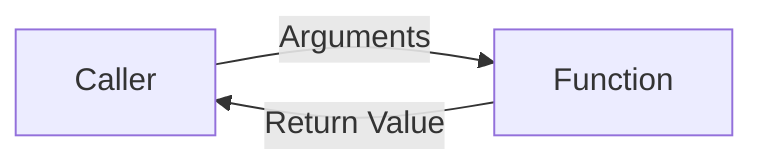

# Preparatory Unit P-U04: How Can a Large Problem Be Divided into Understandable Work?

Version: 1.0.0  
Status: Official student material  
Last updated: 2026-08-04  
Corresponding Chinese version: [前導單元 P-U04：如何把一個大問題拆成可理解的工作？](unit-04-functions-integration.zh-TW.md)

## Purpose and Completion Standard

This is a student chapter for independent reading, practice, and review. Completing it means you can separate responsibilities with functions, trace parameters and return values, divide a small requirement into testable parts, and run regression tests after a requirement changes.

The activities do not need to be submitted. Keep your responsibility diagrams, call traces, programs, tests, and corrections.

## What Question Does This Chapter Answer?

When a program has only a few lines, putting everything in `main` may still seem readable. As input, calculation, decisions, and output become mixed together, every change becomes harder.

> When a program grows longer, how can responsibilities be separated so each part can be understood, tested, and modified?

After completing this chapter, you should be able to:

1. Describe a function's responsibility in one sentence.
2. Distinguish declaration, definition, call, parameter, argument, and return value.
3. Trace data flow through a function call.
4. Divide a small requirement into independently testable functions.
5. Update callers and tests after an interface changes.

Prerequisite: you can use variables, conditions, and loops in small programs and create expected results and tests.

---

## 1. Identify Responsibilities First

Requirement: read a score and bonus, calculate the adjusted score, and display it.

Consider whether one function should be responsible for all three actions:

1. Read input
2. Calculate the bonus
3. Display the result

If the calculation rule changes, which part should change? If you want to test the calculation, should keyboard input be required every time?

---

## 2. A Function Is a Named Responsibility

A function is not only a way to shorten code. It packages one task as a unit with a name, inputs, and a result.



A useful responsibility statement is:

> `add_bonus` receives an original score and a bonus and returns the adjusted score.

It does not read the keyboard or print the screen.

---

## 3. Minimal Function Example

```c
#include <stdio.h>

int add_bonus(int score, int bonus) {
    return score + bonus;
}

int main(void) {
    int result = add_bonus(80, 5);
    printf("%d\n", result);
    return 0;
}
```

Expected output:

```text
85
```

### Function Definition

```c
int add_bonus(int score, int bonus)
```

- first `int`: return type
- `add_bonus`: function name
- `score`, `bonus`: parameters

### Function Call

```c
add_bonus(80, 5)
```

`80` and `5` are arguments. Their values are given to the parameters.

### Return Value

```c
return score + bonus;
```

The function gives a result back to the caller.

---

## 4. Call Trace

| Step | Location | State or data |
|---|---|---|
| 1 | `main` | prepares arguments 80 and 5 |
| 2 | `add_bonus` | `score = 80`, `bonus = 5` |
| 3 | `add_bonus` | computes and returns 85 |
| 4 | `main` | `result = 85` |
| 5 | `main` | displays 85 |

The caller pauses its current work, and execution continues from the call location after the function completes.

---

## 5. Declaration, Definition, and Call

When a definition appears after `main`, provide a prototype first:

```c
int add_bonus(int score, int bonus);
```

Complete form:

```c
#include <stdio.h>

int add_bonus(int score, int bonus);

int main(void) {
    printf("%d\n", add_bonus(80, 5));
    return 0;
}

int add_bonus(int score, int bonus) {
    return score + bonus;
}
```

- declaration/prototype: tells the compiler the interface
- definition: provides the work
- call: uses the function

---

## 6. Error Case One: Ignoring the Return Value

```c
int score = 80;
add_bonus(score, 5);
printf("%d\n", score);
```

Predict first. `add_bonus` returns 85, but the caller does not store the result, so `score` remains 80.

One correction is:

```c
score = add_bonus(score, 5);
```

Explain the correction with a call trace rather than memorizing the syntax alone.

---

## 7. Error Case Two: Too Many Responsibilities

```c
void do_everything(void) {
    /* input, calculate, classify, print */
}
```

This function is difficult to test independently and makes the effect of a rule change unclear.

A clearer division might be:

```text
main: coordinate the flow
calculate_average: calculate an average
is_passing: decide whether it passes
print_report: present the result
```

The goal is not the largest possible number of functions. Each function should have a clear responsibility.

---

## 8. Error Case Three: Confusing Parameter Order

```c
double divide(double numerator, double denominator);
```

Call:

```c
divide(2, 10)
```

The result is `0.2`, not `5.0`. Parameter order is part of the interface contract. Meaningful names and tests reduce this risk.

---

## 9. Guided Practice: Larger Value

Create:

```c
int max_of_two(int a, int b);
```

Responsibility: receive two integers and return the larger one.

Create tests first:

| `a` | `b` | Expected result |
|---:|---:|---:|
| 5 | 3 | 5 |
| 2 | 7 | 7 |
| 4 | 4 | 4 |

Then write the function and trace one call.

---

## 10. Independent Integrated Practice: Score Reporter

Requirement: read three quiz scores and display the average and `Pass` or `Try again`.

Suggested responsibilities:

```c
double calculate_average(int a, int b, int c);
int is_passing(double average);
```

Process:

```text
Understand requirement
→ create tests
→ divide responsibilities
→ define interfaces
→ implement
→ trace calls
→ run tests
→ correct
```

Test an average below 60, exactly 60, above 60, and one combination that produces a fraction.

---

## 11. Requirement Modification

The passing threshold is no longer fixed at 60. The caller provides it.

Possible interface:

```c
int is_passing(double average, double threshold);
```

Identify:

1. Which interface changes?
2. Which call sites must be updated?
3. Which tests must be added?
4. Which old tests should still pass?

---

## 12. Test Functions, Not Only the Whole Screen

When responsibilities are clear, inputs and return values can be tested directly:

| Function | Input | Expected return |
|---|---|---|
| `add_bonus` | 80, 5 | 85 |
| `max_of_two` | 4, 4 | 4 |
| `is_passing` | 59.9, 60 | false |
| `is_passing` | 60.0, 60 | true |

This makes the error location easier to narrow down.

---

## 13. Explain the Concept to AI

Explain in your own words:

> What is the relationship among a function's responsibility, parameters, arguments, and return value? Why does separation of responsibility help testing and modification?

An AI response may be incomplete or incorrect. If it conflicts with a call trace, function test, or reproducible result, judge it again using evidence.

---

## 14. Self-Check

- I can describe a function's responsibility in one sentence.
- I can distinguish declaration, definition, and call.
- I can distinguish parameters and arguments.
- I can trace where a return value goes.
- I can diagnose an ignored return value.
- I can divide a small requirement into testable functions.
- I can update callers and tests after an interface changes.

---

## 15. Chapter Summary

Functions organize work into named units with interfaces and responsibilities. Callers provide arguments, parameters receive data, and functions return results. Responsibility separation improves understanding, testing, debugging, and requirement changes. The formal course continues by deepening data representation, control flow, memory, and engineering practices.

## Navigation

- [Previous Unit: How Does a Program Select and Repeat?](unit-03-control-flow.en.md)
- [Formal-Course Materials Index](../formal/README.en.md)
- [Materials Index](../README.en.md)
- [繁體中文版](unit-04-functions-integration.zh-TW.md)
