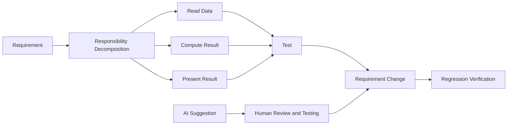

# Preparatory Unit 4: Functions, Integrated Development, and AI Verification

Version: 0.2.0  
Status: Official teaching material  
Last updated: 2026-08-03  
Major change summary: Removed homework submission, per-item passing, remediation, and repeated micro-oral wording; reframed the unit around student-retained records, formative classroom discussion, and final-oral preparation.  
Corresponding Chinese version: [前導單元 4：函數、整合開發與 AI 驗證](unit-04-functions-integration.zh-TW.md)

## Document Purpose

The Chinese preparatory track uses this material across Sessions 3–4; the English preparatory track splits it between Session 4 (functions and decomposition) and Session 5 (integrated cycle and AI verification).

## Basic Information

- Requirement IDs: `CAP-F01` through `CAP-F04`, `EDU-03`, `EDU-04`, `X-03` through `X-06`
- Competency IDs: `PC-F01` through `PC-F05`, `PC-V01` through `PC-V05`, `PC-A01` through `PC-A05`, `PC-I01`
- Target maturity: L2–L4
- Scope state: `SB-C` / `SB-F`
- Formative tasks: `AT-02`, `AT-04` through `AT-11`
- Final oral preparation: `AT-12`
- Risk IDs: `R-01`, `R-02`, `R-05`, `R-12`
- Estimated time: Chinese 240–300 minutes; English 240 minutes

## 1. Learning Objectives

Students can:

1. Describe a function's single responsibility in one sentence.
2. Distinguish declaration, definition, call, parameter, and return value.
3. Decompose a small requirement into independently testable functions.
4. Complete a cycle of understanding, design, implementation, testing, debugging, modification, and regression verification.
5. Review an AI suggestion and accept, modify, or reject it using evidence.

## 2. Prerequisites

- Use data, conditions, and loops in a small program.
- Establish expected results and boundary cases.
- Trace state and diagnose basic defects.

When prerequisites are weak, use formative support rather than homework resubmission or copied programs.

## 3. Tools and Environment

- GCC or Clang with C17 support.
- Compile: `gcc -std=c17 -Wall -Wextra -pedantic report.c -o report`
- Fallback: an instructor-tested online C compiler.

## 4. Information Priority

### Must Understand

- Functions establish responsibility and interfaces; they are not merely a way to shorten code.
- The caller provides inputs, and the function provides results through a return value.
- A completed program still requires testing, modification, diagnosis, and explanation.
- AI suggestions require student verification.

### Must Complete and Retain

- One responsibility-decomposition diagram.
- One short function with parameters and a return value.
- One requirement modification with regression testing.
- One AI-suggestion review record.

These records are not submitted or individually graded. Students retain them for classroom discussion and final oral preparation.

### May Be Deferred

- Multi-file programs, function pointers, full recursion implementation, and large project architecture.

## 5. Core Question

> When a problem grows, how do we separate responsibilities and prove that the solution remains trustworthy after change?

## 6. Visual Model



## 7. Minimal Function Example

```c
#include <stdio.h>

int add_bonus(int score, int bonus) {
    return score + bonus;
}

int main(void) {
    int result = add_bonus(80, 5);
    printf("%d\n", result);
    return 0;
}
```

Responsibility: `add_bonus` only calculates the adjusted score; it does not handle input or output.

## 8. Call Trace

| Step | Caller / Function | Data |
|---|---|---|
| 1 | `main` calls `add_bonus(80, 5)` | parameters `score=80`, `bonus=5` |
| 2 | `add_bonus` computes | `85` |
| 3 | Return to `main` | `result=85` |
| 4 | `main` prints | `85` |

## 9. Responsibility-Decomposition Activity

Requirement: “Read three quiz scores, calculate the average, and print whether the student passes.”

Suggested decomposition:

- `read_score`: input may remain in `main`; the preparatory course does not require a separate input function.
- `calculate_average`: receives three scores and returns the average.
- `is_passing`: receives the average and returns whether it meets the threshold.
- `main`: coordinates input, calls, and output.

Other reasonable decompositions are allowed, but each function must have a one-sentence responsibility.

## 10. Common Errors

### Ignoring the Return Value

```c
add_bonus(score, bonus);
printf("%d\n", score);
```

The function returns 85, but `score` remains 80. Students trace the data flow rather than looking only inside the function.

### Too Many Responsibilities

A function that reads, computes, decides, and prints is difficult to test independently. Students draw responsibilities and separate them.

## 11. Guided Practice

Create `max_of_two(int a, int b)` and return the larger value.

Complete and retain:

1. A one-sentence responsibility.
2. Tests for `a>b`, `a<b`, and `a==b`.
3. A call trace.
4. The program and results.

## 12. Independent Integrated Practice

### Small Score Reporter

Requirement: read three quiz scores and print the average plus `Pass` or `Try again`.

Cycle:

```text
Understand the requirement
→ Define data and tests
→ Draw a responsibility-decomposition diagram
→ Build the smallest version
→ Run normal and boundary cases
→ Diagnose one instructor-provided defect
→ Modify the passing threshold
→ Run regression tests
→ Explain and reflect
```

Retain: decomposition diagram, program, test table, defect record, modification diff, and reflection.

This practice is not submitted or individually graded. The class discusses representative decompositions, defects, and testing strategies.

## 13. Requirement Modification

Change the passing threshold from 60 to a user-provided value, and display the average to one decimal place.

Students identify:

- Which function interface changes.
- Which tests must be added or updated.
- Which original tests should continue to pass.

## 14. AI-Suggestion Review Task

The instructor provides an AI suggestion such as:

> “Store `(a + b + c) / 3` in a `double`; it will always preserve the decimal part.”

Students must:

1. Calculate `80, 81, 82` manually.
2. Run the original suggestion.
3. Explain the integer-division problem.
4. Modify and retest.
5. Accept, modify, or reject the suggestion with evidence.

## 15. AI Use Rules

Permitted: ask AI for candidate tests, compare two decompositions, or propose debugging hypotheses.  
Prohibited: let AI perform the core decomposition, complete the integrated practice, or answer the final oral live.  
Must retain: pre-AI requirement understanding, initial decomposition, self-created tests, AI summary, verification, and decision.

## 16. Formative Learning Evidence and Classroom Discussion

### Understanding-Oriented Evidence

- `EV-EX + EV-VI + EV-TR + EV-AI`
- Explain function responsibilities and interfaces.
- Trace parameters, return values, and data flow.
- Explain the risk and verification method for an AI suggestion.

### Action-Oriented Evidence

- `EV-IM + EV-TE + EV-DE + EV-MO`
- Complete the integrated cycle, requirement change, and regression verification.
- Review and correct one incorrect AI suggestion.

### Formative Prompts

1. Why should this work be separated into functions?
2. Where does the return value go?
3. Which tests should still pass after changing the threshold?
4. How did you prove the AI suggestion correct or incorrect?

These prompts support classroom discussion and participation observation. They are not separate oral exams or per-homework grading.

### Participation Modes

- Propose a responsibility decomposition.
- Trace calls and return values.
- Share a defect, test, or refactoring rationale.
- Compare alternative function interfaces.
- Participate through writing, anonymous questions, program operation, or group records.

## 17. Instructor and TA Guidance

- Accept small, reasonable decompositions rather than demanding large architecture.
- When code is correct but cannot be explained, use formative prompts and a small requirement change rather than per-item remediation.
- When time is short, retain the integrated cycle and AI review; reduce extension features.
- Do not introduce linked lists, trees, function pointers, or frameworks.
- When tools fail, switch to paper tracing or instructor equipment; do not treat the failure as non-participation.

## 18. Final Oral Preparation

Students should be able to select from their own records:

- One function responsibility and interface design.
- One parameter and return-value trace.
- One requirement change with regression testing.
- One AI suggestion they accepted, modified, or rejected.

This unit prepares capability evidence without fixing final oral question types or procedure in advance.

## 19. Unit Summary

Functions establish responsibility boundaries; testing, debugging, modification, and AI verification make results trustworthy. This unit completes the minimum integrated capability of the preparatory course.

## Navigation

- [Materials Index](../README.en.md)
- [Assessment Override](ASSESSMENT-NOTE.en.md)
- [繁體中文版](unit-04-functions-integration.zh-TW.md)
