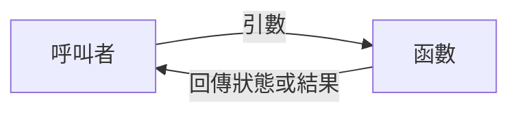

# 前導單元 P-U04：如何把一個大問題拆成可理解的工作？

版本：1.0.2  
狀態：正式學生教材  
最後更新：2026-08-06  
對應英文版本：[Preparatory Unit P-U04: How Can a Large Problem Be Divided into Understandable Work?](unit-04-functions-integration.en.md)

## 文件用途與完成標準

這是一份供初學者獨立閱讀、練習與複習的學生教材。完成本章代表你能用函數分離責任，追蹤參數與回傳值，將小型需求拆成可測試部分，並能定義有效輸入、失敗行為與運算範圍等重要介面條件。

本章活動不需繳交；請自行保存責任分解、呼叫追蹤、程式、測試與修正紀錄。不使用 AI 不影響本章完成；選用的 AI 延伸活動可以直接跳過，也不影響參與或評量。

## 這一章要回答什麼？

當程式只有幾行時，所有工作放在 `main` 中似乎還能閱讀。但當輸入、計算、判斷與輸出開始混在一起，任何修改都會變得困難。

> 當程式開始變長時，如何把責任分開，讓每一部分可以理解、測試與修改？

完成本章後，你應能：

1. 用一句話說明一個函數的責任。
2. 區分函數宣告、定義、呼叫、參數、引數與回傳值。
3. 追蹤函數呼叫中的資料流。
4. 將小型需求拆成可獨立測試的函數。
5. 定義函數的有效輸入與失敗行為。
6. 修改函數介面後更新呼叫端與測試。

前置知識：能使用變數、條件與迴圈完成小型程式，並能建立預期結果與測試。

---

## 1. 先判斷責任

需求：讀入一個成績與加分，計算調整後成績並輸出。

先想：下面三件事是否應由同一個函數負責？

1. 讀取輸入
2. 計算加分
3. 顯示結果

如果計算規則改變，你希望修改哪一部分？如果要測試計算，你是否一定要重新輸入資料？

---

## 2. 函數是有名稱的責任

函數不是只為了縮短程式。它把一項工作包成具有名稱、輸入、結果與契約的單位。



一個好起點是能用一句話描述責任：

> `add_bonus` 接收原始成績與加分；若運算結果可表示，便回報成功並提供調整後成績。

它不負責讀取鍵盤，也不負責印出畫面。

---

## 3. 最小函數範例

```c
#include <limits.h>
#include <stdio.h>

int add_bonus(int score, int bonus, int *result) {
    if (result == NULL) {
        return 0;
    }

    if ((bonus > 0 && score > INT_MAX - bonus) ||
        (bonus < 0 && score < INT_MIN - bonus)) {
        return 0;
    }

    *result = score + bonus;
    return 1;
}

int main(void) {
    int result;

    if (!add_bonus(80, 5, &result)) {
        printf("Invalid calculation\n");
        return 1;
    }

    printf("%d\n", result);
    return 0;
}
```

預期輸出：

```text
85
```

### 函數定義

```c
int add_bonus(int score, int bonus, int *result)
```

- 第一個 `int`：狀態回傳型別
- `add_bonus`：函數名稱
- `score`、`bonus`、`result`：參數

### 函數呼叫

```c
add_bonus(80, 5, &result)
```

`80`、`5` 與 `&result` 是引數，其值交給參數。

### 狀態與輸出

函數成功時回傳 1，並透過 `result` 寫入計算結果。若輸出指標為空，或加法會超出 `int` 可表示範圍，則回傳 0 且不寫入。

---

## 4. 呼叫追蹤

| 步驟 | 執行位置 | 狀態或資料 |
|---|---|---|
| 1 | `main` | 準備 80、5 與 `&result` |
| 2 | `add_bonus` | 檢查輸出指標與運算範圍 |
| 3 | `add_bonus` | 寫入 85 並回傳成功 |
| 4 | `main` | 觀察成功，`result = 85` |
| 5 | `main` | 輸出 85 |

呼叫者暫停目前工作，函數完成後再從呼叫位置繼續。

---

## 5. 宣告、定義與呼叫

當函數定義放在 `main` 後方時，可先提供函數原型：

```c
int add_bonus(int score, int bonus, int *result);
```

- 宣告／原型：告訴編譯器介面
- 定義：提供實際工作
- 呼叫：使用函數

宣告與定義的回傳型別及參數型別必須一致。

---

## 6. 錯誤案例一：忽略回傳狀態

```c
int score = 80;
int result;
add_bonus(score, 5, &result);
printf("%d\n", result);
```

若呼叫失敗，`result` 不保證已被寫入。呼叫端必須先檢查狀態再使用輸出。

正確模式：

```c
if (add_bonus(score, 5, &result)) {
    printf("%d\n", result);
}
```

---

## 7. 錯誤案例二：函數承擔過多責任

```c
void do_everything(void) {
    /* input, calculate, classify, print */
}
```

這種函數難以獨立測試，也讓修改規則時難以判斷影響範圍。

比較好的分解可能是：

```text
main：協調流程
calculate_average：計算平均
is_passing：判斷是否及格
print_report：呈現結果
```

前導階段不追求函數越多越好，而是每個函數責任清楚。

---

## 8. 錯誤案例三：參數順序與前置條件混淆

```c
double divide(double numerator, double denominator);
```

呼叫：

```c
divide(2, 10)
```

結果是 `0.2`，不是 `5.0`。參數順序是介面契約的一部分。介面也必須定義 `denominator == 0.0` 的行為；若需求要求普通商值，就不能把浮點無限值或例外狀態視為正常結果。

---

## 9. 引導練習：較大值

建立：

```c
int max_of_two(int a, int b);
```

責任：接收兩個整數，回傳較大值。

先建立測試：

| `a` | `b` | 預期結果 |
|---:|---:|---:|
| 5 | 3 | 5 |
| 2 | 7 | 7 |
| 4 | 4 | 4 |
| `INT_MIN` | `INT_MAX` | `INT_MAX` |

再寫函數並追蹤一次呼叫。

---

## 10. 自主整合練習：成績報告器

需求：讀入三次小考成績，輸出平均與 `Pass`／`Try again`。

建議責任：

```c
int calculate_average(int a, int b, int c, double *average);
int is_passing(double average, double threshold);
```

實作前定義成績範圍、輸出指標行為，以及如何避免三個整數先相加時發生有號溢位。

流程：

```text
理解需求
→ 建立測試
→ 分解責任
→ 定義介面與失敗行為
→ 實作
→ 追蹤呼叫
→ 執行測試
→ 修正
```

至少測試低於 60、剛好 60、高於 60、產生小數、無效成績與極端整數。

---

## 11. 需求修改

及格門檻不再固定為 60，而是由呼叫者提供。

介面可能改為：

```c
int is_passing(double average, double threshold);
```

請指出：

1. 哪個函數介面改變？
2. 哪些呼叫位置必須更新？
3. 門檻有哪些有效範圍規則？
4. 哪些測試需要新增？
5. 哪些舊測試仍應通過？

---

## 12. 測試函數而不是只測整個畫面

函數責任清楚後，可以直接測試輸入、狀態與輸出：

| 函數 | 輸入 | 預期結果 |
|---|---|---|
| `add_bonus` | 80, 5, 有效輸出 | 成功且為 85 |
| `add_bonus` | `INT_MAX`, 1, 有效輸出 | 失敗，輸出不變 |
| `add_bonus` | 80, 5, `NULL` | 失敗 |
| `max_of_two` | 4, 4 | 4 |
| `is_passing` | 59.9, 60 | false |
| `is_passing` | 60.0, 60 | true |

這讓錯誤範圍更容易縮小。

---

## 13. 選用延伸：使用 AI 檢查自己的解釋

本節為選用活動，可以直接跳過，不影響本章完成。

你可以用自己的話向 AI 解釋：

> 函數的責任、參數、引數、回傳狀態與輸出值之間有什麼關係？為什麼運算範圍與無效輸入行為也必須寫進介面？

不需要固定 Prompt，也不需要保存或繳交對話。AI 的回應可能不完整或錯誤；若它與呼叫追蹤、型別上限、函數測試或可重現結果不一致，請以證據重新判斷。

---

## 14. 自我檢核

- 我能用一句話描述函數責任。
- 我能區分宣告、定義與呼叫。
- 我能區分參數與引數。
- 我能追蹤回傳狀態與輸出值。
- 我能找出忽略失敗狀態的錯誤。
- 我能定義運算與輸入契約。
- 我能在介面修改後更新呼叫端與測試。

---

## 15. 本章摘要

函數把工作組織成有名稱、有介面、有責任的單位。可靠介面必須說明輸入、輸出、失敗行為與運算限制。呼叫者提供引數、檢查狀態，並只在成功後使用輸出。責任分離讓理解、測試、除錯與需求修改更容易。正式課程將繼續深化資料表示、控制流程、記憶體與工程能力。

## 導覽

- [上一單元：程式如何選擇與重複？](unit-03-control-flow.zh-TW.md)
- [正式課程教材索引](../formal/README.zh-TW.md)
- [教材索引](../README.zh-TW.md)
- [English version](unit-04-functions-integration.en.md)
