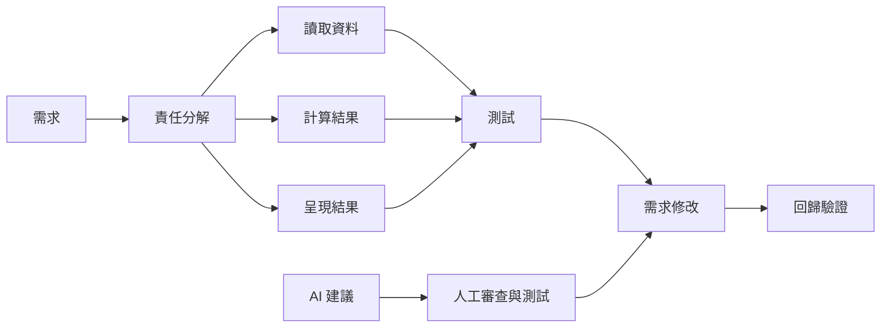

# 前導單元 4：函數、整合開發與 AI 驗證

版本：0.2.0  
狀態：正式教學教材  
最後更新：2026-08-03  
重大變更摘要：移除作業繳交、逐份通過、補驗與重複微型口試語意；改為自主保存、課堂形成性討論與最終口試準備。  
對應英文版本：[Preparatory Unit 4: Functions, Integrated Development, and AI Verification](unit-04-functions-integration.en.md)

## 文件用途

中文前導班安排於第 3–4 堂；英文前導班將內容拆分為 Session 4（函數與分解）及 Session 5（整合循環與 AI 驗證）。

## 基本資料

- 需求 ID：`CAP-F01` 至 `CAP-F04`、`EDU-03`、`EDU-04`、`X-03` 至 `X-06`
- 能力 ID：`PC-F01` 至 `PC-F05`、`PC-V01` 至 `PC-V05`、`PC-A01` 至 `PC-A05`、`PC-I01`
- 目標成熟度：L2–L4
- 範圍狀態：`SB-C`／`SB-F`
- 形成性任務：`AT-02`、`AT-04` 至 `AT-11`
- 最終口試準備：`AT-12`
- 風險 ID：`R-01`、`R-02`、`R-05`、`R-12`
- 預估時間：中文 240–300 分鐘；英文 240 分鐘

## 一、學習目標

學生能：

1. 用一句話說明函數的單一責任。
2. 區分函數宣告、定義、呼叫、參數與回傳值。
3. 將小型需求分成可獨立測試的函數。
4. 完成理解、設計、實作、測試、除錯、修改與回歸驗證循環。
5. 審查 AI 建議並以證據採用、修改或拒絕。

## 二、前置知識

- 能使用資料、條件與迴圈完成小型程式。
- 能建立預期結果與邊界案例。
- 能追蹤程式狀態並診斷基本錯誤。

若前置能力不足，教師可安排形成性補救活動，不以補交作業或抄寫完整程式取代理解。

## 三、工具與環境

- GCC 或 Clang，C17。
- 編譯：`gcc -std=c17 -Wall -Wextra -pedantic report.c -o report`
- 備援：教師測試過的線上 C 編譯器。

## 四、資訊優先級

### 必須理解

- 函數用來建立責任與介面，不只是縮短程式。
- 呼叫者提供輸入，函數透過回傳值提供結果。
- 完成程式後仍需測試、修改、診斷與說明。
- AI 建議必須由學生驗證。

### 必須完成並自行保存

- 一張責任分解圖。
- 一個具參數與回傳值的短函數。
- 一次需求修改與回歸測試。
- 一次 AI 建議審查紀錄。

這些紀錄不需繳交或逐份計分，作為課堂討論與最終口試準備素材。

### 目前可跳過

- 多檔案程式、函數指標、完整遞迴實作與大型專案架構。

## 五、核心問題

> 當問題變大時，如何分離責任，並證明自己的解法在修改後仍然可信？

## 六、視覺模型



## 七、函數最小範例

```c
#include <stdio.h>

int add_bonus(int score, int bonus) {
    return score + bonus;
}

int main(void) {
    int result = add_bonus(80, 5);
    printf("%d\n", result);
    return 0;
}
```

責任：`add_bonus` 只計算加分後成績，不負責輸入或輸出。

## 八、呼叫追蹤

| 步驟 | 呼叫者／函數 | 資料 |
|---|---|---|
| 1 | `main` 呼叫 `add_bonus(80, 5)` | 參數 `score=80`, `bonus=5` |
| 2 | `add_bonus` 計算 | `85` |
| 3 | 回傳給 `main` | `result=85` |
| 4 | `main` 輸出 | `85` |

## 九、責任分解活動

需求：「讀入三次小考成績，計算平均，輸出是否及格。」

建議分解：

- `read_score`：可由 `main` 直接讀入，前導階段不要求另寫函數。
- `calculate_average`：接收三個分數，回傳平均。
- `is_passing`：接收平均，回傳是否及格。
- `main`：協調輸入、呼叫與輸出。

學生可提出其他合理分解，但每個函數必須能用一句話說明責任。

## 十、常見錯誤

### 忘記使用回傳值

```c
add_bonus(score, bonus);
printf("%d\n", score);
```

函數回傳 85，但 `score` 仍是 80。學生須追蹤資料流，不能只看函數內部。

### 函數承擔過多工作

一個函數同時輸入、計算、判斷、輸出，難以獨立測試。要求學生畫出責任並拆分。

## 十一、引導練習

建立 `max_of_two(int a, int b)`，回傳較大值。

先完成並自行保存：

1. 函數責任一句話。
2. `a>b`、`a<b`、`a==b` 三個測試。
3. 呼叫追蹤。
4. 程式與結果。

## 十二、自主整合練習

### 小型成績報告器

需求：讀入三次小考成績，輸出平均與 `Pass`／`Try again`。

流程：

```text
理解需求
→ 定義資料與測試
→ 畫責任分解圖
→ 建立最小版本
→ 執行正常與邊界案例
→ 診斷一個教師提供的缺陷
→ 修改及格門檻
→ 回歸測試
→ 說明與反思
```

自行保存：分解圖、程式、測試表、缺陷紀錄、修改差異與反思。

本練習不需繳交或逐份計分；課堂會討論代表性分解、缺陷與測試策略。

## 十三、需求修改

將及格門檻從 60 改為使用者輸入，並新增規則：平均最高顯示到小數點後一位。

學生須指出：

- 哪個函數介面需要改變。
- 哪些測試需要新增或更新。
- 哪些原測試應繼續通過。

## 十四、AI 建議審查任務

教師提供一段 AI 建議，例如：

> 「平均可用 `(a + b + c) / 3` 存入 `double`，一定會得到小數。」

學生須：

1. 先手算 `80, 81, 82`。
2. 執行原建議。
3. 解釋整數除法問題。
4. 修改並重新測試。
5. 決定採用、修改或拒絕，附證據。

## 十五、AI 使用規則

允許：請 AI 提供測試候選、比較兩種函數分解、提出除錯假設。  
禁止：讓 AI 完成核心分解、完整自主整合練習或即時代答最終口試。  
必須保留：使用前需求理解、初步分解、自建測試、AI 摘要、驗證與決策。

## 十六、形成性學習證據與課堂討論

### 理解型證據

- `EV-EX + EV-VI + EV-TR + EV-AI`
- 能說明函數責任與介面。
- 能追蹤參數、回傳值與資料流。
- 能說明 AI 建議的風險與驗證方式。

### 行動型證據

- `EV-IM + EV-TE + EV-DE + EV-MO`
- 能完成整合循環、修改需求與回歸驗證。
- 能審查並修正一個錯誤 AI 建議。

### 形成性追問

1. 為什麼這段工作應拆成函數？
2. 回傳值去了哪裡？
3. 修改門檻後，哪些測試仍應通過？
4. 你如何證明 AI 建議正確或錯誤？

這些問題用於課堂討論與參與觀察，不是獨立口試或逐份作業評分。

### 課堂參與方式

- 提出責任分解方案。
- 追蹤呼叫與回傳值。
- 分享缺陷、測試或重構理由。
- 比較不同函數介面。
- 以書面、匿名提問、程式操作或小組紀錄參與。

## 十七、教師與助教指引

- 先接受小而合理的分解，不追求大型架構。
- 若學生程式正確但不能解釋，以形成性追問與小型需求修改補強，不建立逐份補驗制度。
- 時間不足時保留整合循環與 AI 審查，減少延伸功能。
- 不引入鏈結串列、樹、函數指標或框架。
- 工具故障時改用紙上追蹤或教師設備，不視為未參與。

## 十八、最終口試準備

學生應能從自己的紀錄中選出：

- 一個函數責任與介面設計。
- 一次參數與回傳值追蹤。
- 一次需求修改與回歸測試。
- 一個曾接受、修改或拒絕的 AI 建議。

本單元只準備能力證據，不預先固定最終口試題型與流程。

## 十九、單元摘要

函數建立責任邊界；測試、除錯、修改與 AI 驗證讓結果可信。本單元完成前導課程的最低整合能力。

## 導覽

- [教材索引](../README.zh-TW.md)
- [評量制度補充規則](ASSESSMENT-NOTE.zh-TW.md)
- [English version](unit-04-functions-integration.en.md)
